# Configuración de motores de bases de datos

## 1. Estructura del proyecto

A continuación se presenta la organización de directorios utilizada para el laboratorio de bases de datos `ia-lab`:

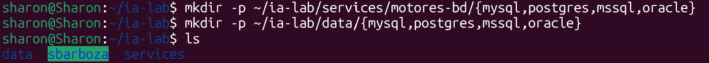

### Red compartida en Docker

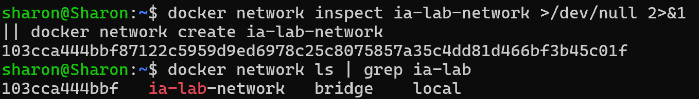

---

## 2. MySQL

### Pasos de configuración:

1. **Definición del servicio:**  
   Se estructuró el archivo `docker-compose.yml` correspondiente a MySQL:  
   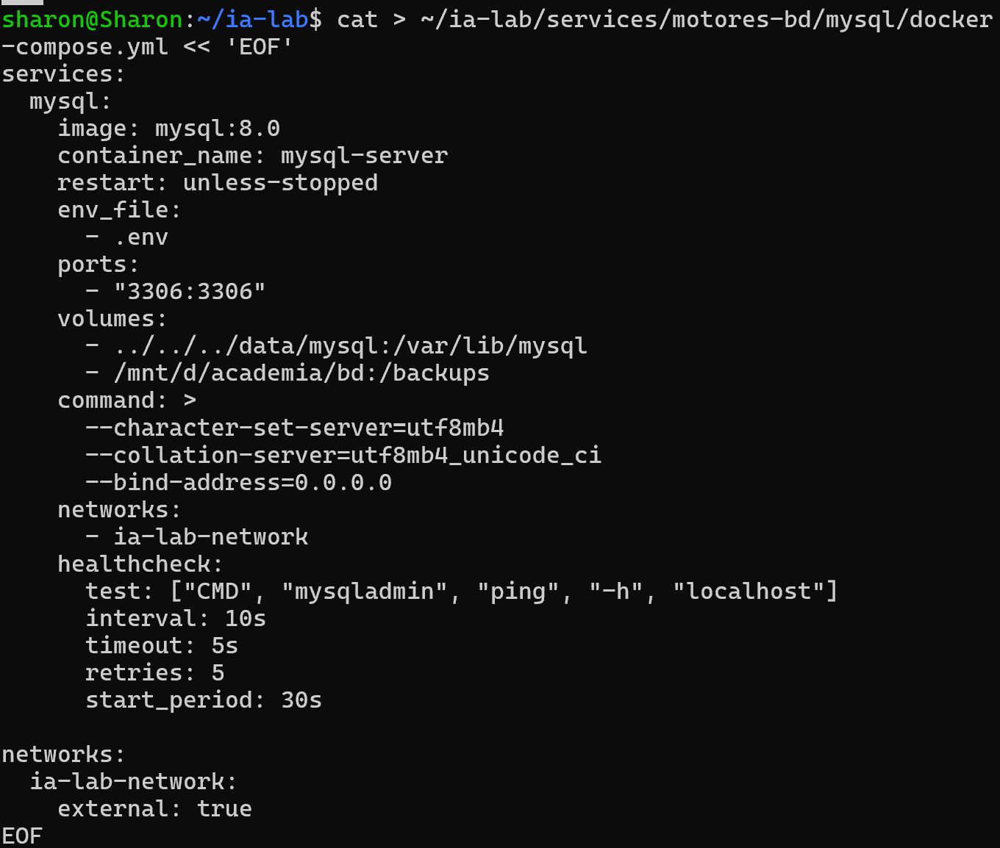  

   Posteriormente, se inicializó el contenedor en segundo plano ejecutando `docker compose up -d`:  
   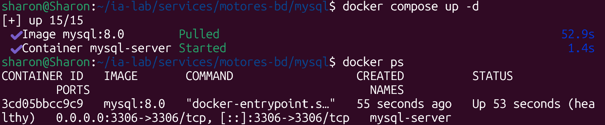

2. **Variables de entorno:**  
   Se definió el archivo `.env` con las credenciales y configuraciones iniciales:  
   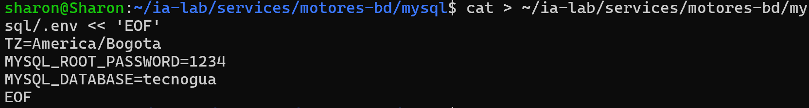

3. **Documentación del servicio:**  
   Se generó el archivo `README.md` con las instrucciones específicas de este motor:  
   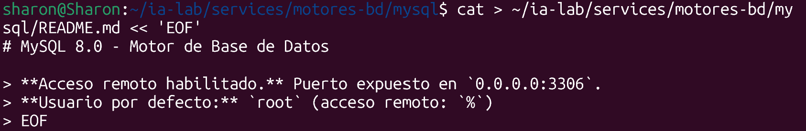

4. **Conexión remota:**  
   Se comprobó la conectividad remota al servicio desde un cliente externo:  
   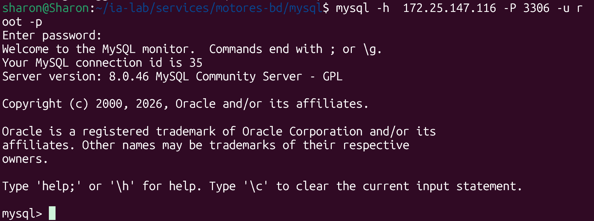

5. **Gestión de usuarios:**  
   Se creó un usuario personalizado con privilegios de acceso remoto:  
   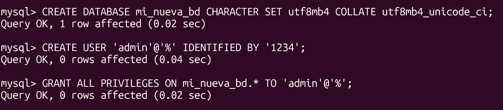

6. **Respaldos de base de datos:**  
   Para la gestión de copias de seguridad, se habilitó el directorio `backups/mysql` dentro de la estructura principal de `ia-lab`:  
   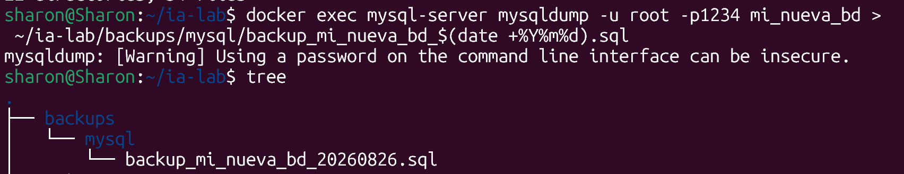

7. **Verificación del estado:**  
   Se ejecutó el levantamiento del contenedor y se verificó que el servicio estuviera operando correctamente:  
   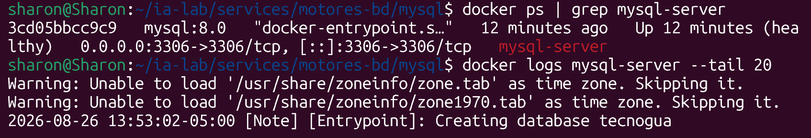  
   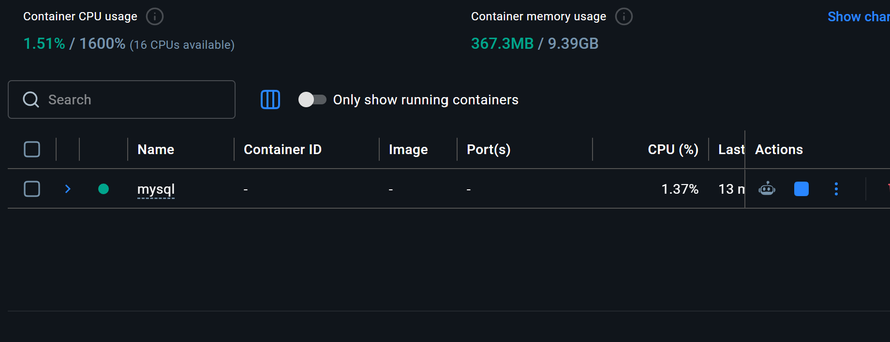

---

## 3. PostgreSQL

### Pasos de configuración:

1. **Definición del servicio:**  
   Se estructuró el archivo `docker-compose.yml` para PostgreSQL y se desplegó la instancia mediante `docker compose up -d`:  
   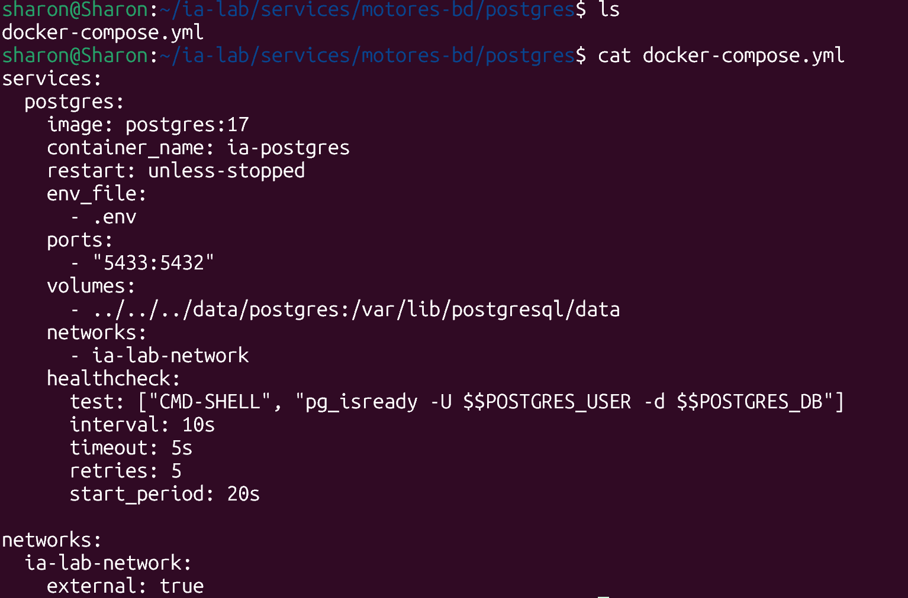

2. **Variables de entorno:**  
   Se creó el archivo `.env` para almacenar las credenciales correspondientes:  
   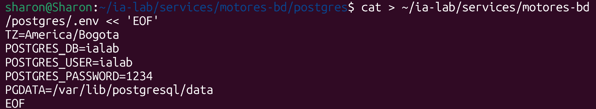

3. **Documentación del servicio:**  
   Se agregó el archivo `README.md` del módulo:  
   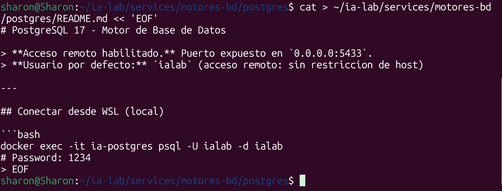

4. **Conexión remota:**  
   Se validó el acceso remoto a la instancia:  
   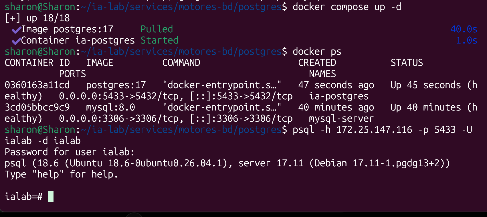

5. **Gestión de usuarios:**  
   Se configuró un usuario individual con permisos de conexión remota:  
   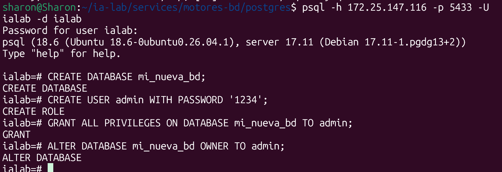

6. **Respaldos de base de datos:**  
   Se habilitó el directorio `backups/postgres` dentro de `ia-lab` para almacenar los respaldos:  
   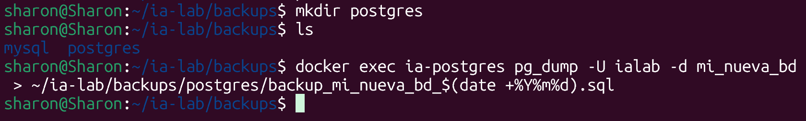

7. **Verificación del estado:**  
   Se ejecutó la puesta en marcha del motor y se confirmó su estado activo:  
   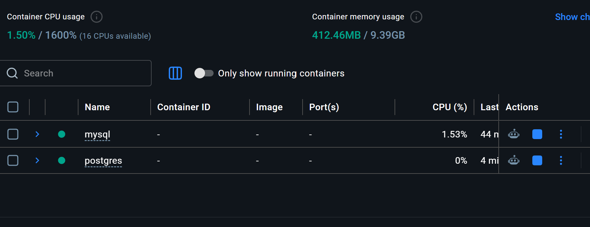

---

## 4. SQL Server

### Pasos de configuración:

1. **Definición del servicio:**  
   Se preparó el archivo `docker-compose.yml` para el motor SQL Server:  
   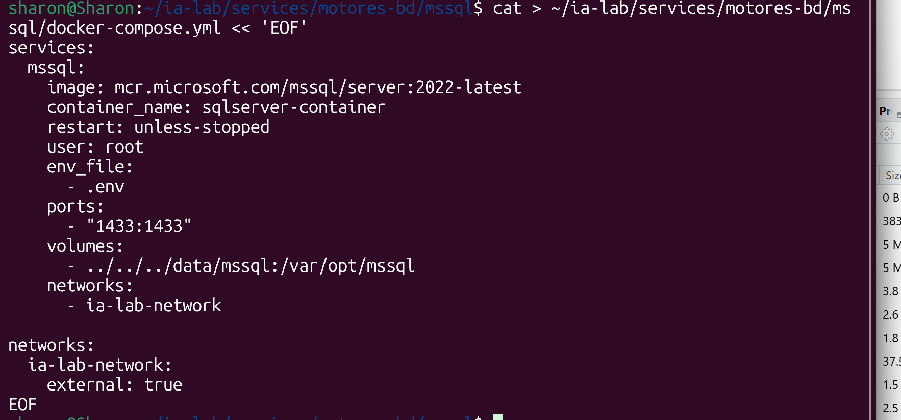

2. **Variables de entorno y despliegue:**  
   Se configuró el archivo `.env` y se inició el contenedor con el comando `docker compose up -d`:  
   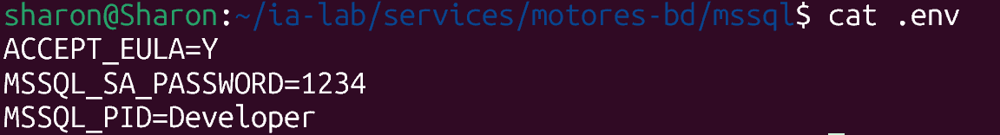  
   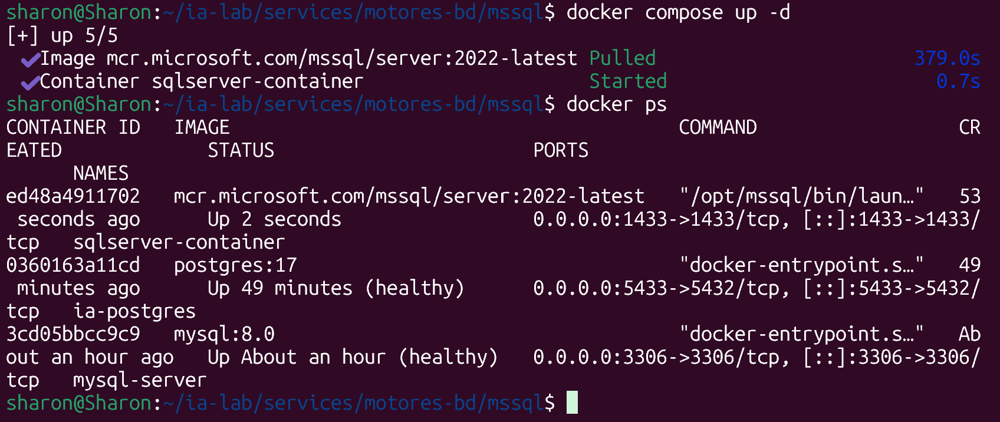

3. **Documentación del servicio:**  
   Se creó el archivo `README.md` específico para este entorno:  
   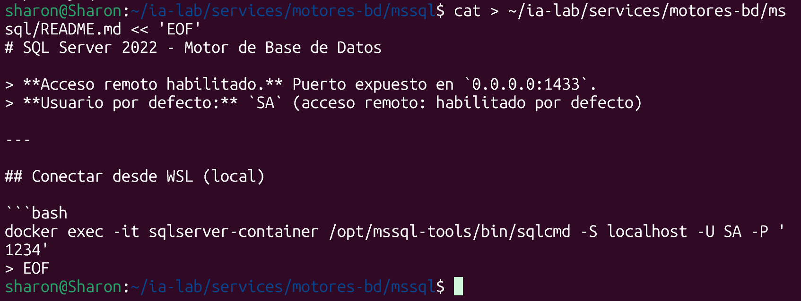

4. **Conexión remota:**  
   Se verificó la conectividad remota hacia el servidor SQL Server:  
   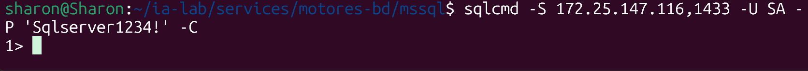

5. **Gestión de usuarios:**  
   Se creó un usuario adicional con acceso habilitado desde la red:  
   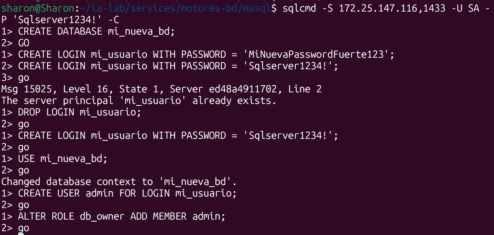

6. **Respaldos de base de datos:**  
   Se asignó la ruta correspondiente para copias de seguridad dentro de la estructura general:  
   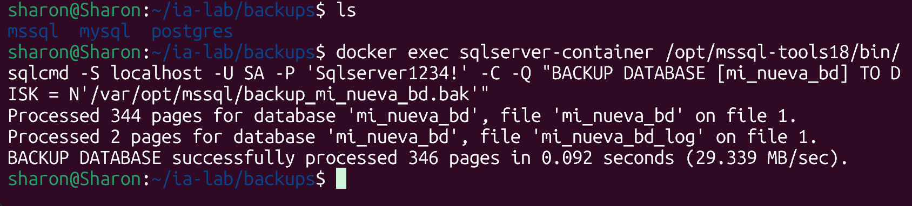  
   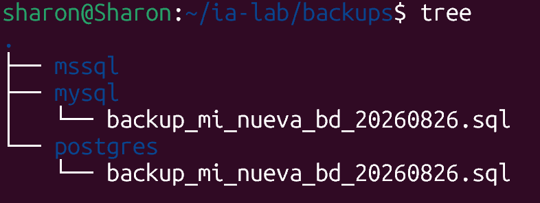

7. **Verificación del estado:**  
   Se confirmó el correcto funcionamiento del servicio:  
   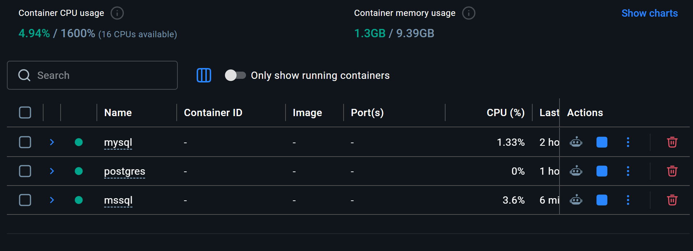

---

## 5. Oracle XE

### Pasos de configuración:

1. **Definición del servicio:**  
   Se creó el archivo `docker-compose.yml` necesario para Oracle XE:  
   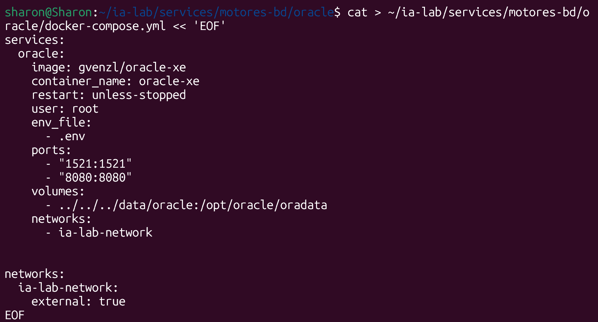

2. **Variables de entorno:**  
   Se estableció el archivo `.env` con los parámetros de conexión y credenciales:  
   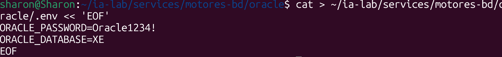

3. **Documentación del servicio:**  
   Se añadió el archivo `README.md` descriptivo del entorno:  
   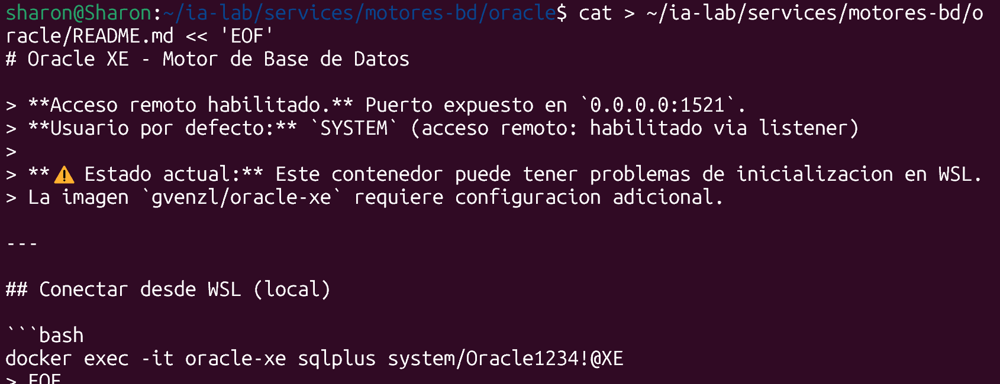

4. **Conexión remota:**  
   Se validó el acceso remoto hacia la base de datos Oracle XE.

5. **Gestión de usuarios:**  
   Se procedió a la creación de un usuario con permisos remotos para la administración del esquema.

6. **Respaldos de base de datos:**  
   Se habilitaron los directorios de backup requeridos en la estructura del proyecto.

7. **Verificación del estado:**  
   Se inició el contenedor de Oracle XE y se confirmó que el proceso se encuentra en ejecución:  
   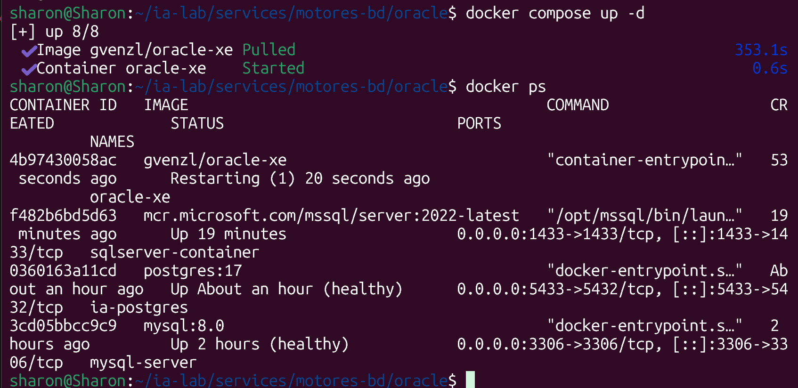