# Guía Paso a Paso: Configuración del Entorno y Backend - EntregaNexo

**Asignatura:** Desarrollo Web\
**Proyecto:** EntregaNexo\
**Documento:** Guía práctica del proceso de configuración

------------------------------------------------------------------------

## 1. Introducción y Contexto del Proyecto

EntregaNexo es una plataforma pensada para conectar comercios locales, compradores y repartidores independientes. En la aplicación: \* Cada pedido puede reunir productos de una tienda específica. \* Los pedidos van cambiando de estado según avanzan en la entrega. \* Se gestiona el cobro al cliente, la comisión de la plataforma y el pago correspondiente al comercio aliado. \* Se asigna al repartidor según su zona y disponibilidad, se hace el seguimiento del pedido y se manejan cancelaciones evitando errores con el dinero.

### ¿Qué hicimos en esta etapa?

Para comenzar con el desarrollo del proyecto, organizamos el trabajo paso a paso: 1. **Bases de Datos con Docker:** Levantamos cuatro bases de datos distintas (**MySQL**, **PostgreSQL**, **SQL Server** y **Oracle**) usando Docker Compose, dejando los datos guardados en carpetas locales. 2. **Estructura Base del Backend (ISS-01):** Creamos el proyecto con NestJS, instalamos las librerías necesarias, preparamos las herramientas de desarrollo y ordenamos las carpetas. 3. **Configuración Global (ISS-02 - En Proceso):** Comenzamos a preparar el manejo seguro y ordenado de las variables de entorno.

A continuación, mostramos en detalle cada uno de los pasos que seguimos:

------------------------------------------------------------------------

## 2. Fase 1: Configuración de las Bases de Datos con Docker

### Paso 1: Creación del archivo `docker-compose.yml`

Comenzamos creando el archivo `docker-compose.yml` en la raíz del proyecto. Aquí definimos los cuatro contenedores de bases de datos que vamos a utilizar, asignando sus puertos y las carpetas locales donde guardarán los datos.

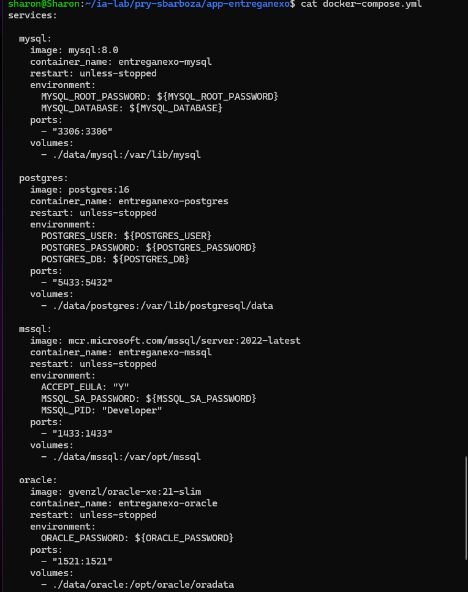

------------------------------------------------------------------------

### Paso 2: Creación del archivo `.env` con las credenciales

Creamos un archivo `.env` para guardar las contraseñas, usuarios, puertos y nombres de las bases de datos de forma segura, evitando que queden escritos directamente en el docker-compose.

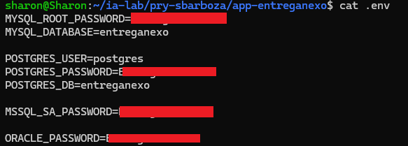

------------------------------------------------------------------------

### Paso 3: Estructura de carpetas para guardar los datos (`data/`)

Para que la información no se borre al apagar o reiniciar los contenedores, organizamos la carpeta `data/` con una subcarpeta para cada base de datos:

``` text
data/
├── mysql/
├── postgres/
├── mssql/
└── oracle/
```

De esta forma, todo lo que guardemos queda almacenado directamente en nuestra computadora.

------------------------------------------------------------------------

### Paso 4: Levantamiento de los cuatro contenedores

Con las configuraciones listas, ejecutamos el comando `docker compose up -d` para iniciar los contenedores en segundo plano. Los cuatro servicios son: \* `entreganexo-mysql` \* `entreganexo-postgres` \* `entreganexo-mssql` \* `entreganexo-oracle`

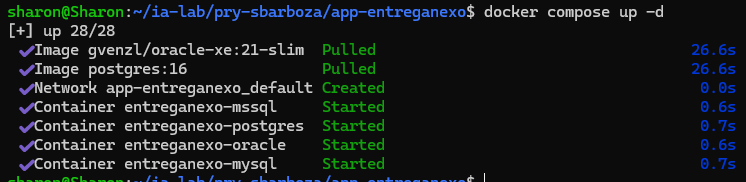

------------------------------------------------------------------------

### Paso 5: Verificación de la red interna de Docker

Revisamos que Docker Compose creara automáticamente la red interna del proyecto. Gracias a esto, los cuatro contenedores pueden conectarse entre sí usando sus propios nombres sin tener que configurar nada más.

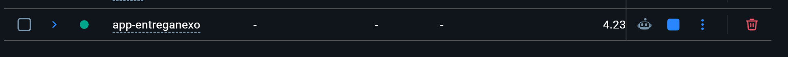

------------------------------------------------------------------------

### Paso 6: Conexión y creación de la base de datos en MySQL

Entramos a la consola del contenedor `entreganexo-mysql` para comprobar el acceso con nuestro usuario y contraseña, y creamos la base de datos para el proyecto.

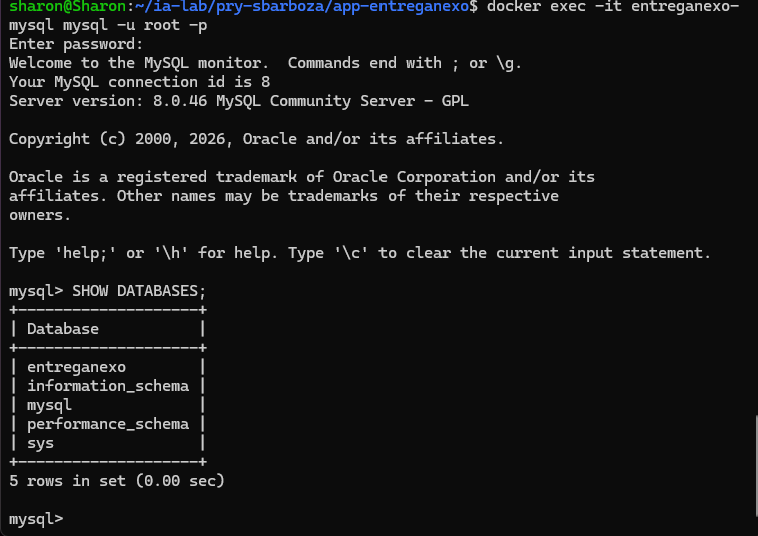

------------------------------------------------------------------------

### Paso 7: Conexión y verificación en PostgreSQL

Hicimos lo mismo con el contenedor `entreganexo-postgres`: entramos con la herramienta `psql`, probamos las credenciales del archivo `.env` y confirmamos que la base de datos estuviera disponible.

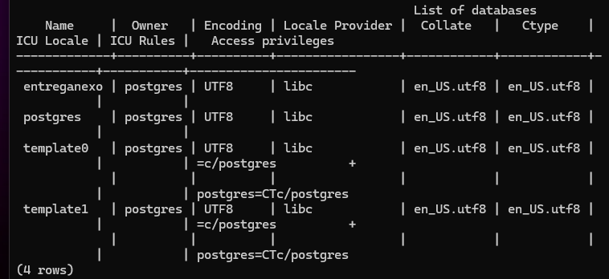

------------------------------------------------------------------------

### Paso 8: Verificación del contenedor de SQL Server (MSSQL)

Revisamos el contenedor `entreganexo-mssql` para asegurarnos de que el servicio de SQL Server hubiera arrancado bien y estuviera listo para recibir conexiones.

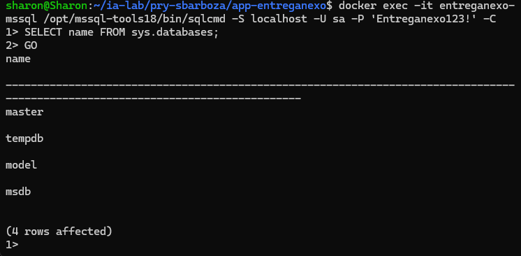

------------------------------------------------------------------------

### Paso 9: Creación de la base de datos en SQL Server

Entramos con la herramienta `sqlcmd` al contenedor de SQL Server y ejecutamos la instrucción para crear la base de datos de EntregaNexo.

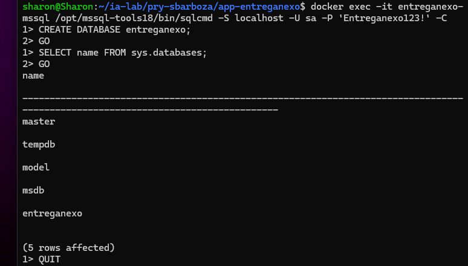

------------------------------------------------------------------------

### Paso 10: Verificación del contenedor de Oracle

Por último, revisamos el contenedor `entreganexo-oracle`. Como este motor tarda un poco más en iniciar, revisamos los registros para confirmar que ya estuviera listo y operativo.

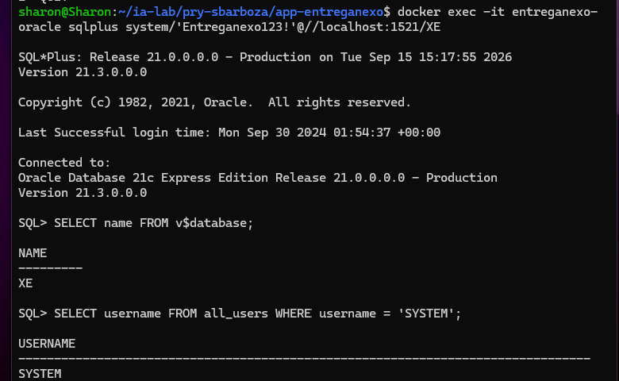

------------------------------------------------------------------------

## 3. Fase 2: Configuración Base del Backend (ISS-01)

### Paso 11: Creación del proyecto base de backend

Con las bases de datos funcionando, entramos a la carpeta `backend/` y creamos el proyecto base con NestJS y TypeScript para empezar a construir la aplicación.

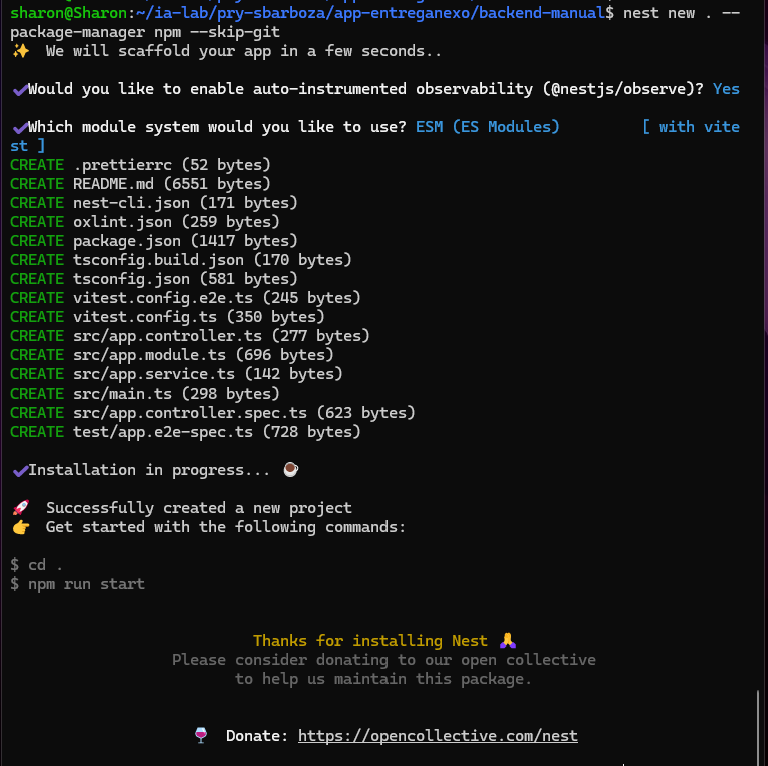

------------------------------------------------------------------------

### Paso 12: Instalación de dependencias del backend

Instalamos los paquetes que necesitamos para que el backend funcione y se conecte a las bases de datos: \* **Sequelize y sequelize-typescript:** para manejar las bases de datos y crear los modelos con clases en TypeScript. \* **Drivers de conexión:** `mysql2` (MySQL), `pg` (PostgreSQL), `tedious` (SQL Server) y `oracledb` (Oracle). \* **Herramientas de apoyo:** `class-validator` y `class-transformer` para validar los datos que llegan a la API, `dotenv` para leer las variables del `.env`, y `@nestjs/swagger` para documentar la API automáticamente.

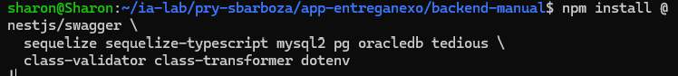

Revisamos en la terminal que todas las librerías se hubieran instalado correctamente:

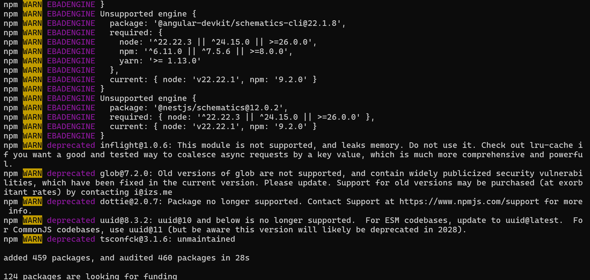

------------------------------------------------------------------------

### Paso 13: Configuración de módulos ESM y scripts en `package.json`

Modificamos el archivo `package.json` agregando `"type": "module"` para usar módulos modernos. Además, definimos los scripts para compilar el proyecto, iniciarlo en desarrollo con recarga automática, formatear el código y correr pruebas con Vitest.

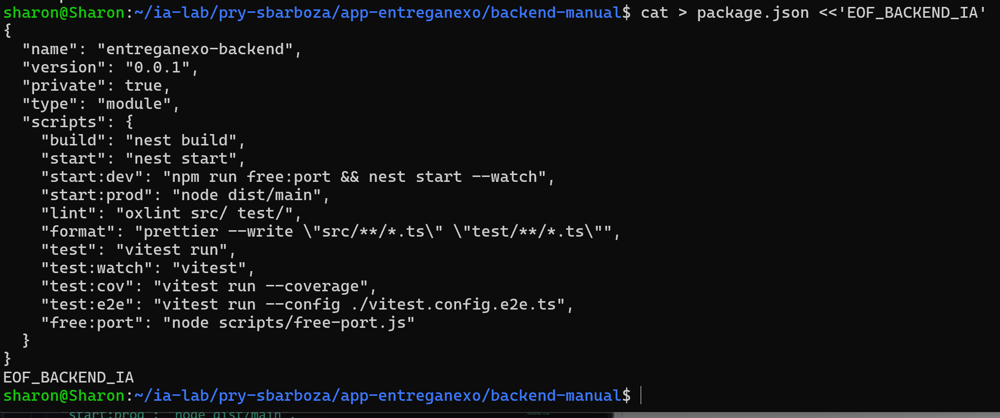

------------------------------------------------------------------------

### Paso 14: Instalación de dependencias de desarrollo y testing

Instalamos herramientas para trabajar de forma más cómoda, revisar errores y hacer pruebas: \* `oxlint`: para revisar errores en el código de forma rápida. \* `prettier`: para que el código quede ordenado y con formato consistente. \* `vitest` y `@vitest/coverage-v8`: para ejecutar las pruebas unitarias y medir la cobertura. \* `supertest`: para hacer pruebas de integración en los endpoints.

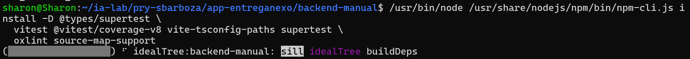

Revisamos en la terminal que se instalaran sin errores:

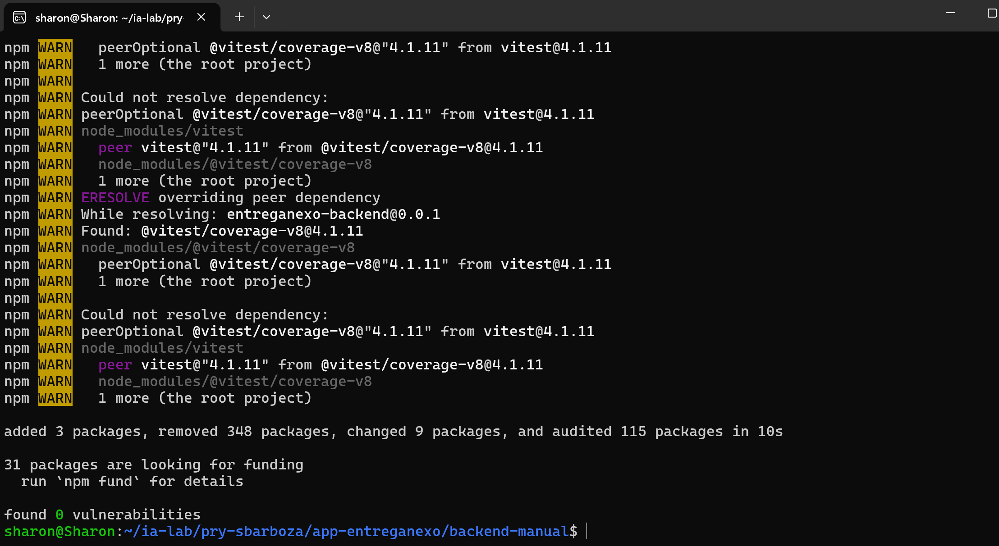

------------------------------------------------------------------------

### Paso 15: Configuración de TypeScript y herramientas de desarrollo

Ajustamos los archivos de configuración para que el compilador y los linters trabajen de manera coordinada:

- **`tsconfig.json`:** configuración principal de TypeScript con soporte para ESM y decoradores. 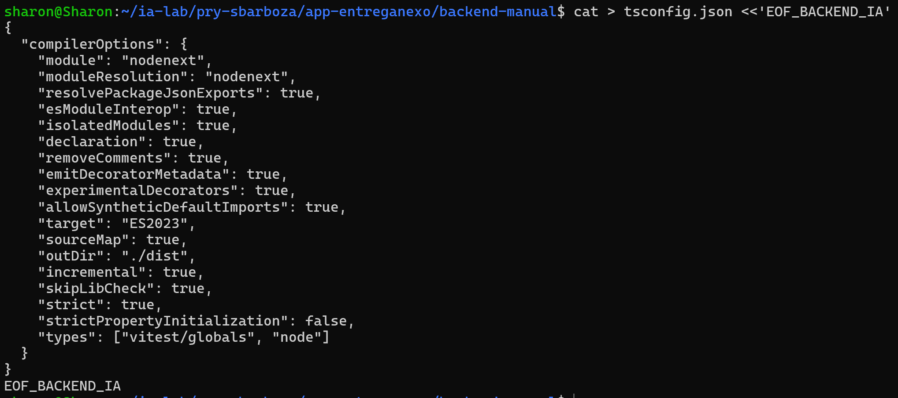

- **`tsconfig.build.json`:** configuración para compilar a producción excluyendo pruebas. 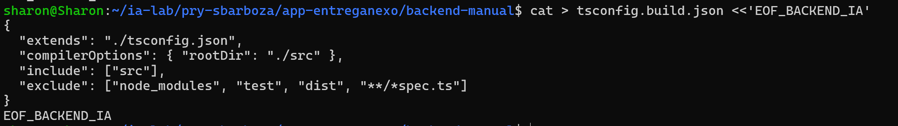

- **`nest-cli.json`:** configuración de los comandos del CLI de NestJS. 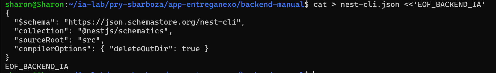

- **`.prettierrc`:** reglas de estilo (comillas, sangría y punto y coma). 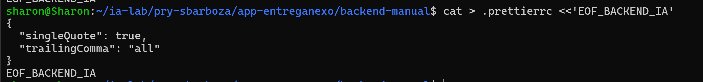

- **`oxlint.json`:** reglas para la revisión del código. 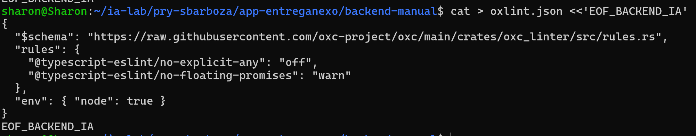

- **`.gitignore`:** confirmamos que estuviera ignorando `node_modules/`, la carpeta de compilación `dist/` y los archivos `.env` con contraseñas reales.

------------------------------------------------------------------------

### Paso 16: Script para liberar puertos y plantilla de entorno

Creamos un pequeño script en `scripts/free-port.js` para que libere automáticamente el puerto antes de iniciar en modo desarrollo y así evitar problemas de puertos ocupados:

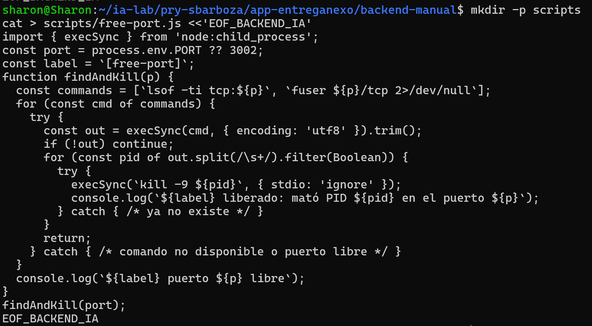

También creamos el archivo `.env.example` como plantilla con todas las variables que requiere el backend (puertos y conexiones de las cuatro bases de datos), para saber qué valores se necesitan sin exponer contraseñas reales:

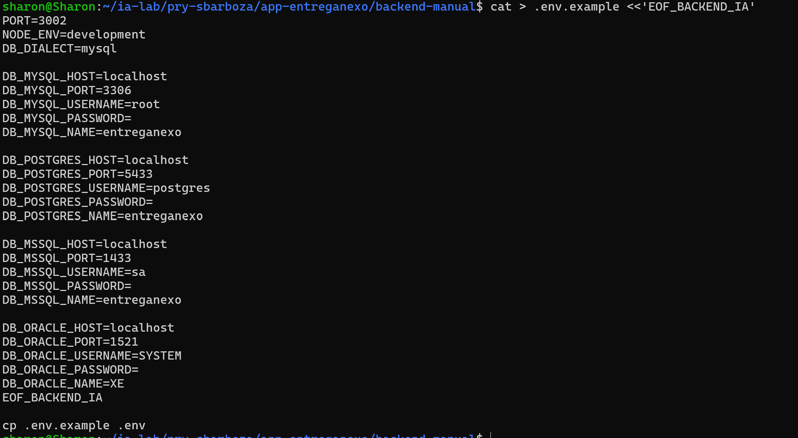

------------------------------------------------------------------------

### Paso 17: Estructura de carpetas para EntregaNexo

Organizamos las carpetas dentro de `src/` según las responsabilidades de nuestro sistema: \* `config/`: para variables de entorno y configuración general. \* `common/`: para utilidades, filtros de errores y cosas compartidas. \* `features/`: para los módulos del negocio (pedidos, tiendas, repartidores, etc.). \* `health/`: para comprobar que el servicio esté respondiendo. \* `infrastructure/`: para la conexión con las bases de datos.

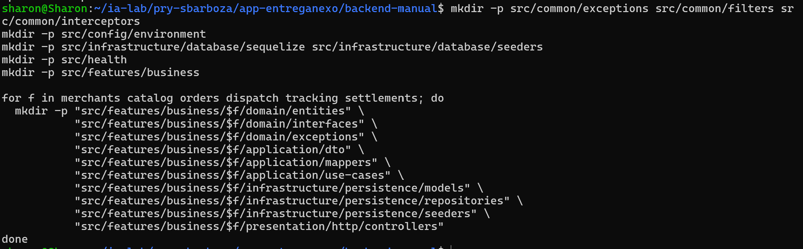

------------------------------------------------------------------------

## 4. Fase 3: Capa de Configuración Global (ISS-02 - En Proceso)

### Paso 18: Tipado de variables de entorno (`env.interface.ts`)

Comenzamos con la tarea **ISS-02**, encargada de la configuración global del backend (variables de entorno, errores, conexión a las bases de datos y Swagger).

El primer paso que estamos realizando es crear el archivo `env.interface.ts` dentro de `src/config/environment/` para definir qué tipos de datos debe tener cada variable de entorno, asegurando que no falte ninguna antes de iniciar la aplicación.

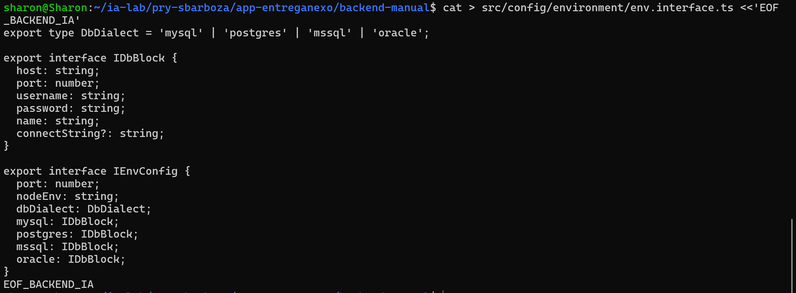

**4.1.2 Validación (`env.validation.ts`):**

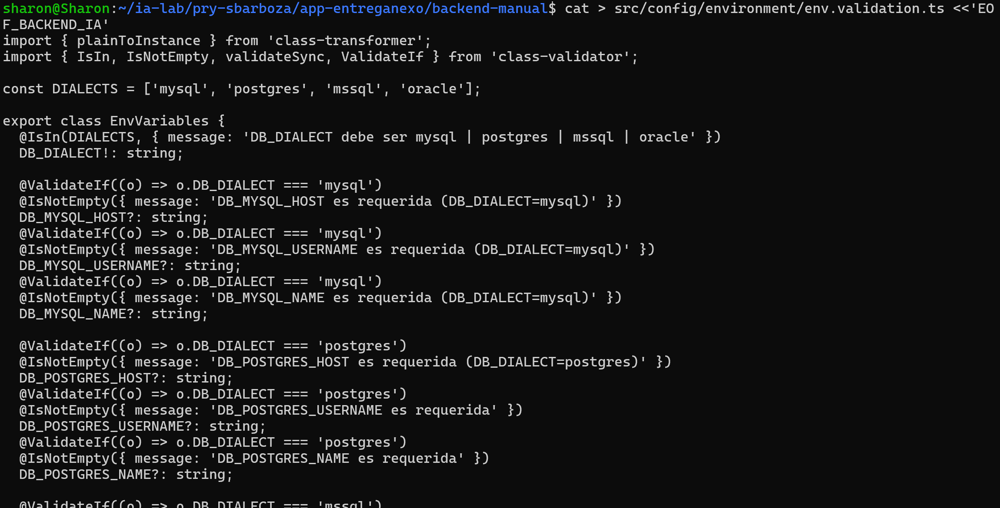

**4.1.3 Selector de BD (`db-env.ts`):**

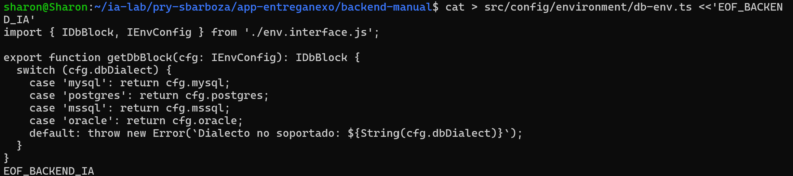

**4.1.4 Carga (`env.config.ts`):**

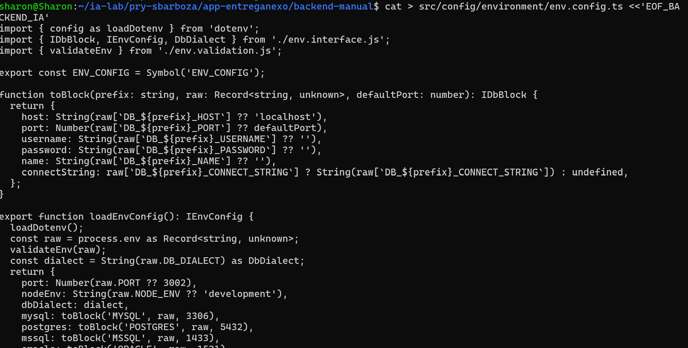

**4.1.5 Módulo global (`environment.module.ts`):**
