# Guía Paso a Paso: Configuración del Entorno y Backend - EntregaNexo

**Asignatura:** Desarrollo Web\
**Proyecto:** EntregaNexo\
**Documento:** Guía práctica del proceso de configuración y desarrollo

------------------------------------------------------------------------

## 1. Introducción y Contexto del Proyecto

EntregaNexo es una plataforma pensada para conectar comercios locales, compradores y repartidores independientes. En la aplicación: \* Cada pedido puede reunir productos de una tienda específica. \* Los pedidos van cambiando de estado según avanzan en la entrega. \* Se gestiona el cobro al cliente, la comisión de la plataforma y el pago correspondiente al comercio aliado. \* Se asigna al repartidor según su zona y disponibilidad, se hace el seguimiento del pedido y se manejan cancelaciones evitando errores con el dinero.

### ¿Qué hicimos en esta etapa?

Para desarrollar el proyecto de manera ordenada, organizamos el trabajo por fases y tareas (*issues*): 1. **Bases de Datos con Docker:** Levantamos cuatro bases de datos distintas (**MySQL**, **PostgreSQL**, **SQL Server** y **Oracle**) usando Docker Compose, guardando la información en carpetas locales. 2. **Estructura Base del Backend (ISS-01):** Creamos el proyecto con NestJS, instalamos librerías necesarias, preparamos herramientas de desarrollo y estructuramos las carpetas. 3. **Configuración Global y Errores (ISS-02):** Validamos variables de entorno, configuramos Sequelize, interceptores, excepciones personalizadas y el filtro global de errores. 4. **Feature Comercios (ISS-03):** Implementamos el módulo de comercios aliados (`merchants`) aplicando Arquitectura Limpia (*Clean Architecture*) en cuatro capas. 5. **Feature Catálogo y Productos (ISS-04):** Construimos el módulo de productos (`catalog`), relacionando los productos con los comercios. 6. **Feature Clientes (ISS-05):** Desarrollamos el módulo de clientes (`clients`), requisito indispensable para la creación de pedidos. 7. **Feature Pedidos y Transacciones Atómicas (ISS-06):** Implementamos el módulo de pedidos (`orders`) con cabecera y detalle, garantizando transacciones seguras para evitar inconsistencias financieras. 8. **Pruebas y Validación con Swagger:** Configuramos pruebas con Vitest y verificamos el funcionamiento de todos los endpoints visualmente en Swagger UI. 9. **Validación Multibase de Datos:** Comprobamos la portabilidad del backend alternando entre **MySQL**, **PostgreSQL**, **SQL Server** y **Oracle** únicamente modificando el archivo `.env`, verificando la conexión y sincronización de las 5 tablas en cada motor.

A continuación, mostramos en detalle cada uno de los pasos que seguimos:

------------------------------------------------------------------------

## 2. Fase 1: Configuración de las Bases de Datos con Docker

### Paso 1: Creación del archivo `docker-compose.yml`

Comenzamos creando el archivo `docker-compose.yml` en la raíz del proyecto. Aquí definimos los cuatro contenedores de bases de datos que vamos a utilizar, asignando sus puertos y las carpetas locales donde guardarán los datos.


------------------------------------------------------------------------

### Paso 2: Creación del archivo `.env` con las credenciales

Creamos un archivo `.env` para guardar las contraseñas, usuarios, puertos y nombres de las bases de datos de forma segura, evitando que queden escritos directamente en el docker-compose.


------------------------------------------------------------------------

### Paso 3: Estructura de carpetas para guardar los datos (`data/`)

Para que la información no se borre al apagar o reiniciar los contenedores, organizamos la carpeta `data/` con una subcarpeta para cada base de datos:

``` text
data/
├── mysql/
├── postgres/
├── mssql/
└── oracle/
```

De esta forma, todo lo que guardemos queda almacenado directamente en nuestra computadora.

------------------------------------------------------------------------

### Paso 4: Levantamiento de los cuatro contenedores

Con las configuraciones listas, ejecutamos el comando `docker compose up -d` para iniciar los contenedores en segundo plano. Los cuatro servicios son: \* `entreganexo-mysql` \* `entreganexo-postgres` \* `entreganexo-mssql` \* `entreganexo-oracle`


------------------------------------------------------------------------

### Paso 5: Verificación de la red interna de Docker

Revisamos que Docker Compose creara automáticamente la red interna del proyecto. Gracias a esto, los cuatro contenedores pueden conectarse entre sí usando sus propios nombres sin tener que configurar nada más.


------------------------------------------------------------------------

### Paso 6: Conexión y creación de la base de datos en MySQL

Entramos a la consola del contenedor `entreganexo-mysql` para comprobar el acceso con nuestro usuario y contraseña, y creamos la base de datos para el proyecto.


------------------------------------------------------------------------

### Paso 7: Conexión y verificación en PostgreSQL

Hicimos lo mismo con el contenedor `entreganexo-postgres`: entramos con la herramienta `psql`, probamos las credenciales del archivo `.env` y confirmamos que la base de datos estuviera disponible.


------------------------------------------------------------------------

### Paso 8: Verificación del contenedor de SQL Server (MSSQL)

Revisamos el contenedor `entreganexo-mssql` para asegurarnos de que el servicio de SQL Server hubiera arrancado bien y estuviera listo para recibir conexiones.


------------------------------------------------------------------------

### Paso 9: Creación de la base de datos en SQL Server

Entramos con la herramienta `sqlcmd` al contenedor de SQL Server y ejecutamos la instrucción para crear la base de datos de EntregaNexo.


------------------------------------------------------------------------

### Paso 10: Verificación del contenedor de Oracle

Por último, revisamos el contenedor `entreganexo-oracle`. Como este motor tarda un poco más en iniciar, revisamos los registros para confirmar que ya estuviera listo y operativo.


------------------------------------------------------------------------

## 3. Fase 2: Configuración Base del Backend (ISS-01)

### Paso 11: Creación del proyecto base de backend

Con las bases de datos funcionando, entramos a la carpeta `backend/` y creamos el proyecto base con NestJS y TypeScript para empezar a construir la aplicación.


------------------------------------------------------------------------

### Paso 12: Instalación de dependencias del backend

Instalamos los paquetes que necesitamos para que el backend funcione y se conecte a las bases de datos: \* **Sequelize y sequelize-typescript:** para manejar las bases de datos y crear los modelos con clases en TypeScript. \* **Drivers de conexión:** `mysql2` (MySQL), `pg` (PostgreSQL), `tedious` (SQL Server) y `oracledb` (Oracle). \* **Herramientas de apoyo:** `class-validator` y `class-transformer` para validar los datos que llegan a la API, `dotenv` para leer las variables del `.env`, y `@nestjs/swagger` para documentar la API automáticamente.


Revisamos en la terminal que todas las librerías se hubieran instalado correctamente:


------------------------------------------------------------------------

### Paso 13: Configuración de módulos ESM y scripts en `package.json`

Modificamos el archivo `package.json` agregando `"type": "module"` para usar módulos modernos. Además, definimos los scripts para compilar el proyecto, iniciarlo en desarrollo con recarga automática, formatear el código y correr pruebas con Vitest.


------------------------------------------------------------------------

### Paso 14: Instalación de dependencias de desarrollo y testing

Instalamos herramientas para trabajar de forma más cómoda, revisar errores y hacer pruebas: \* `oxlint`: para revisar errores en el código de forma rápida. \* `prettier`: para que el código quede ordenado y con formato consistente. \* `vitest` y `@vitest/coverage-v8`: para ejecutar las pruebas unitarias y medir la cobertura. \* `supertest`: para hacer pruebas de integración en los endpoints.


Revisamos en la terminal que se instalaran sin errores:


------------------------------------------------------------------------

### Paso 15: Configuración de TypeScript y herramientas de desarrollo

Ajustamos los archivos de configuración para que el compilador y los linters trabajen de manera coordinada:

- **`tsconfig.json`:** configuración principal de TypeScript con soporte para ESM y decoradores. 

- **`tsconfig.build.json`:** configuración para compilar a producción excluyendo pruebas. 

- **`nest-cli.json`:** configuración de los comandos del CLI de NestJS. 

- **`.prettierrc`:** reglas de estilo (comillas, sangría y punto y coma). 

- **`oxlint.json`:** reglas para la revisión del código. 

- **`.gitignore`:** confirmamos que estuviera ignorando `node_modules/`, la carpeta de compilación `dist/` y los archivos `.env` con contraseñas reales.

------------------------------------------------------------------------

### Paso 16: Script para liberar puertos y plantilla de entorno

Creamos un pequeño script en `scripts/free-port.js` para que libere automáticamente el puerto antes de iniciar en modo desarrollo y así evitar problemas de puertos ocupados:


También creamos el archivo `.env.example` como plantilla con todas las variables que requiere el backend (puertos y conexiones de las cuatro bases de datos), para saber qué valores se necesitan sin exponer contraseñas reales:


------------------------------------------------------------------------

### Paso 17: Estructura de carpetas para EntregaNexo

Organizamos las carpetas dentro de `src/` según las responsabilidades de nuestro sistema: \* `config/`: para variables de entorno y configuración general. \* `common/`: para utilidades, filtros de errores y cosas compartidas. \* `features/`: para los módulos del negocio (pedidos, tiendas, repartidores, etc.). \* `health/`: para comprobar que el servicio esté respondiendo. \* `infrastructure/`: para la conexión con las bases de datos.


------------------------------------------------------------------------

## 4. Fase 3: Capa de Configuración Global y Errores (ISS-02)

### Paso 18: Tipado de variables de entorno (`env.interface.ts`)

Iniciamos la tarea **ISS-02** encargada de la configuración global del backend. Creamos el archivo `env.interface.ts` en `src/config/environment/` para definir los tipos de datos de cada variable (puerto, entorno, dialecto y credenciales de las bases de datos), asegurando el tipado estricto con TypeScript.


------------------------------------------------------------------------

### Paso 19: Validación de variables de entorno (`env.validation.ts`)

Creamos el archivo `env.validation.ts` utilizando decoradores de `class-validator` y `class-transformer` para revisar que las variables obligatorias del dialecto activo (`DB_DIALECT`) estén completas al arrancar la aplicación, evitando errores en ejecución.


------------------------------------------------------------------------

### Paso 20: Selector de base de datos activa (`db-env.ts`)

Creamos la función en `db-env.ts` para elegir automáticamente las variables y datos de conexión según el motor que esté seleccionado en `DB_DIALECT`.

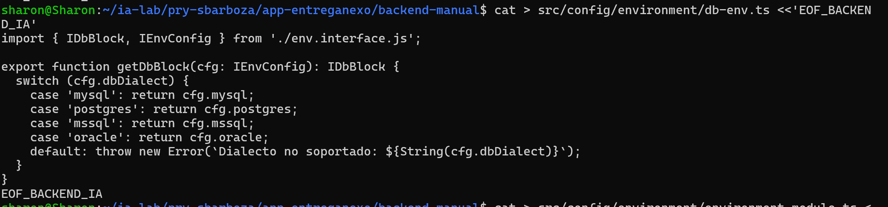

------------------------------------------------------------------------

### Paso 21: Carga centralizada de la configuración (`env.config.ts`)

Creamos el archivo `env.config.ts` para leer y estructurar todas las variables validadas en un solo objeto de configuración accesible en toda la aplicación.

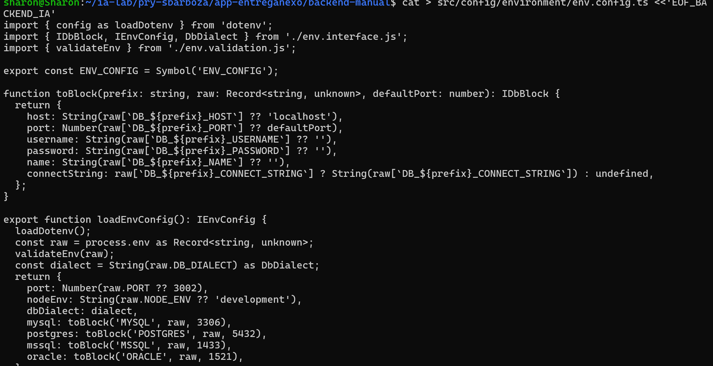

------------------------------------------------------------------------

### Paso 22: Módulo global de entorno (`environment.module.ts`)

Definimos `environment.module.ts` como un módulo global (`@Global()`) de NestJS para que cualquier servicio pueda usar la configuración sin necesidad de volver a importar el módulo.

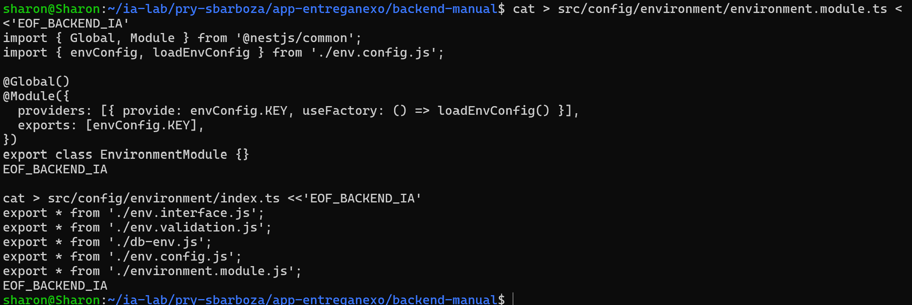

------------------------------------------------------------------------

### Paso 23: Archivo de exportación centralizada (`index.ts`)

Creamos el archivo `index.ts` en `src/config/environment/` para exportar de forma limpia interfaces, clases y módulos de esta carpeta.

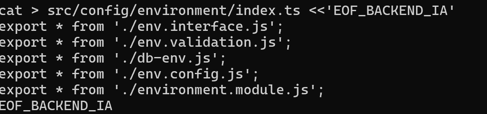

------------------------------------------------------------------------

### Paso 24: Excepciones personalizadas (`common/exceptions`)

Para no manejar errores con códigos genéricos, creamos excepciones propias en `common/exceptions`: \* `domain.exception.ts` y `application.exception.ts`: errores base del dominio y la aplicación. \* `business-rule.exception.ts`: para cuando se incumple una regla del negocio en EntregaNexo. \* `entity-not-found.exception.ts`: para indicar con claridad cuando un registro no existe.

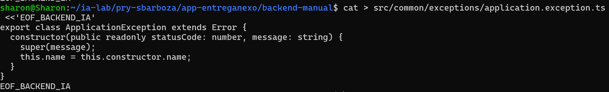

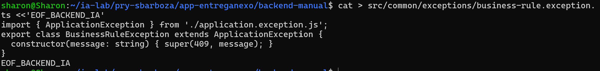

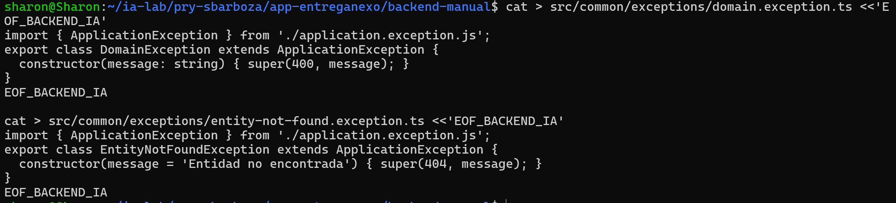

------------------------------------------------------------------------

### Paso 25: Filtro global de errores (`common/filters/global-exception.filter.ts`)

Creamos el filtro `global-exception.filter.ts` para interceptar cualquier fallo en la aplicación y devolver una respuesta clara, estandarizada y ordenada (código de estado, mensaje y fecha).

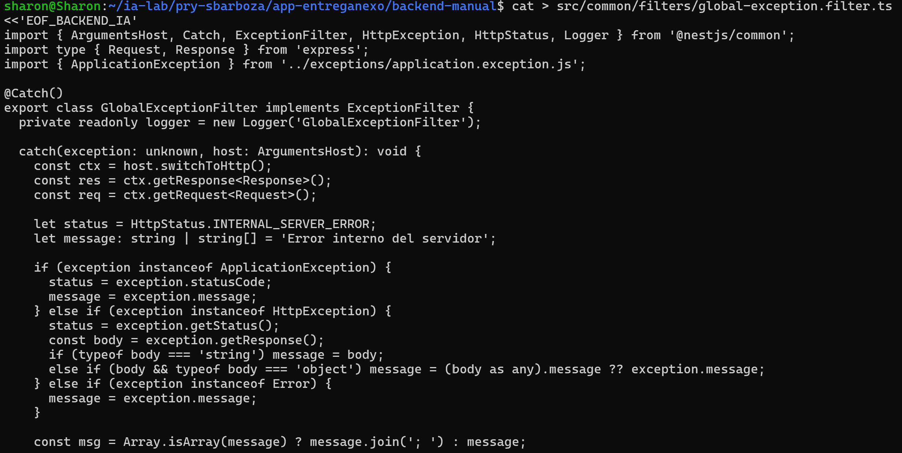

------------------------------------------------------------------------

### Paso 26: Interceptores para logs y respuestas (`common/interceptors`)

Creamos los interceptores en `src/common/interceptors/` para monitorear el rendimiento de la aplicación y estandarizar las respuestas: \* `logging.interceptor.ts`: para registrar cada petición que entra y su duración. \* `response.interceptor.ts`: para dar un formato unificado a todas las respuestas exitosas de la API. \* `timeout.interceptor.ts`: para cancelar peticiones que tarden más de lo debido.

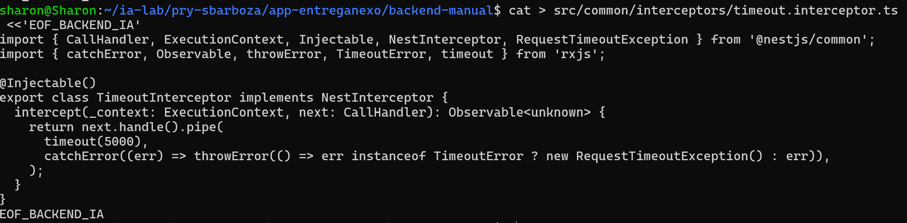

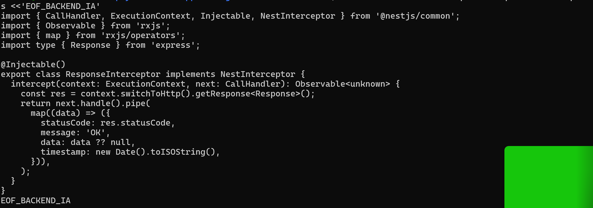

------------------------------------------------------------------------

### Paso 27: Conexión y persistencia con Sequelize (`infrastructure/database`)

Configuramos la capa de persistencia conectando Sequelize con la base de datos activa según las variables de entorno configuradas previamente.

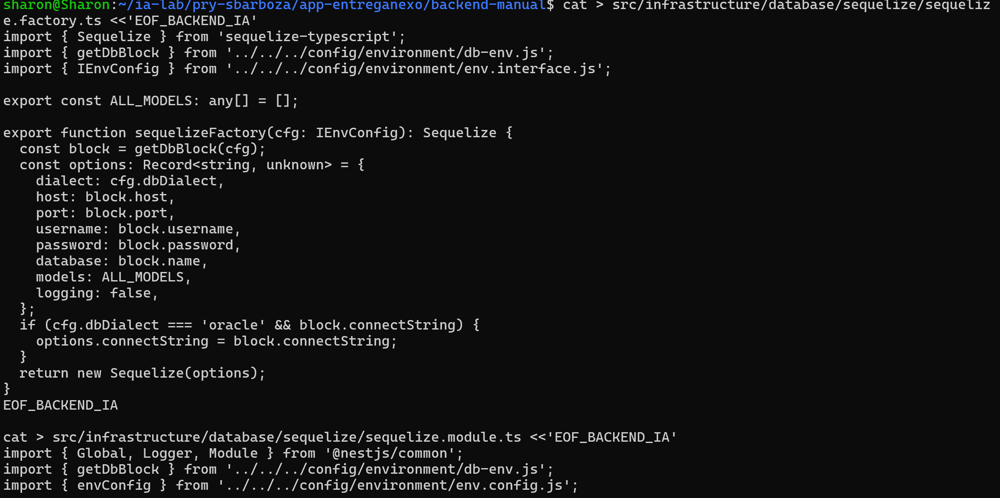

------------------------------------------------------------------------

### Paso 28: Verificación y arranque del backend

Completada la configuración global (**ISS-02**), probamos el servidor ejecutando `npm run start:dev` para certificar que compila correctamente, se conecta a la base de datos y queda escuchando peticiones sin errores.

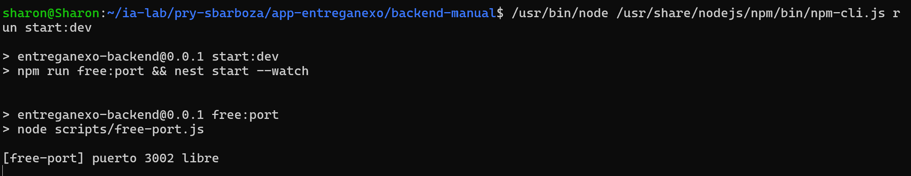

------------------------------------------------------------------------

## 5. Fase 4: Implementación de la Feature Comercios (ISS-03)

Para construir las funcionalidades del negocio, implementamos la primera feature completa: **Comercios (`merchants`)**, aplicando el patrón de **Arquitectura Limpia (*Clean Architecture*)** dividido en cuatro capas ordenadas: `domain` → `application` → `infrastructure` → `presentation`.

### Paso 29: Capa de dominio de comercios (`domain`)

Definimos la entidad pura `Merchant` y sus reglas de negocio básicas, manteniéndola totalmente independiente de la base de datos y de frameworks externos.

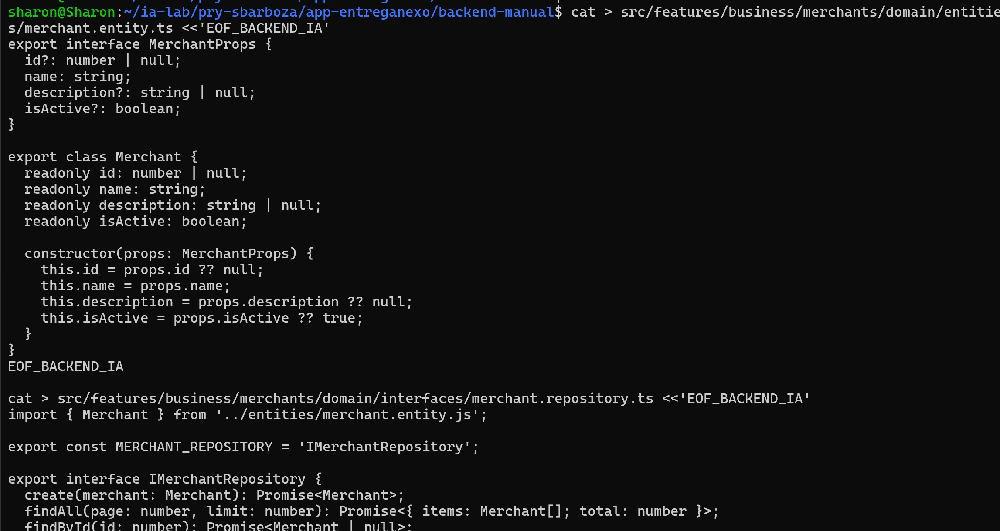

------------------------------------------------------------------------

### Paso 30: Capa de aplicación (`application`)

Implementamos los casos de uso y la lógica para crear, consultar y administrar los comercios aliados dentro de EntregaNexo.

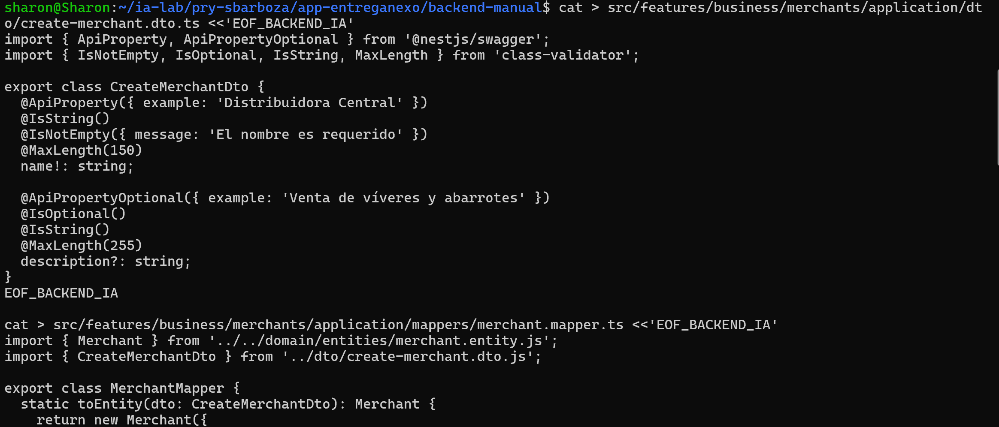

------------------------------------------------------------------------

### Paso 31: Capa de infraestructura (`infrastructure`)

Implementamos el acceso a datos conectando la entidad con la base de datos mediante los modelos y repositorios de Sequelize.

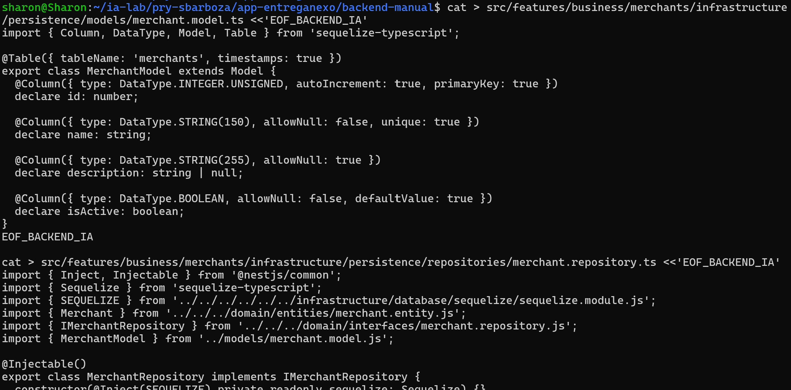

------------------------------------------------------------------------

### Paso 32: Capa de presentación (`presentation`)

Creamos el controlador HTTP con sus endpoints para recibir las solicitudes web y delegar el trabajo a la capa de aplicación.

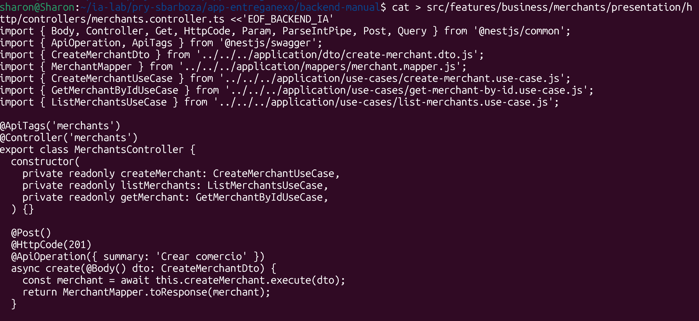

------------------------------------------------------------------------

### Paso 33: Módulo de la feature y registro en Sequelize

Agrupamos todas las capas anteriores dentro de `merchants.module.ts` y registramos el modelo de comercios en la configuración de Sequelize para que la base de datos lo sincronice.

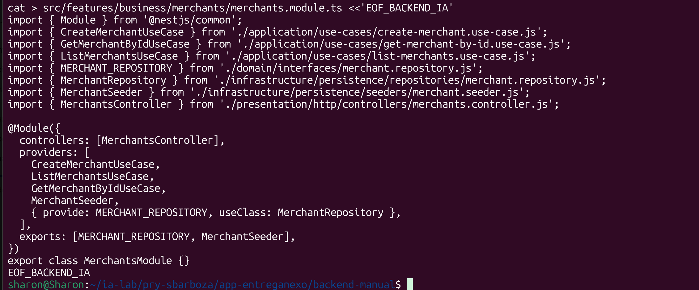

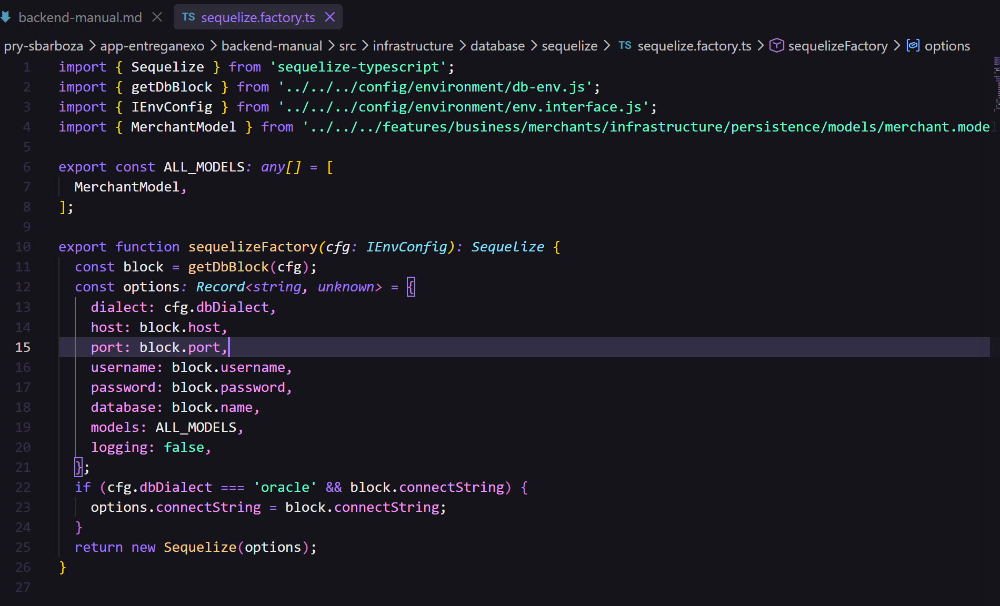

------------------------------------------------------------------------

## 6. Fase 5: Feature de Catálogo y Productos (ISS-04)

En la tarea **ISS-04**, replicamos el patrón de Arquitectura Limpia para la entidad **Producto** dentro del módulo `catalog`.

En **EntregaNexo**, los productos tienen una relación **Comercio 1:N Producto**: un producto no puede existir sin estar asociado a un comercio aliado, y por regla de negocio no se pueden agregar productos a comercios inactivos.

### Paso 34: Capa de dominio de productos (`domain`)

Definimos la entidad `Product` y sus interfaces de dominio, especificando sus atributos (nombre, precio, stock, estado y el enlace con el comercio correspondiente).

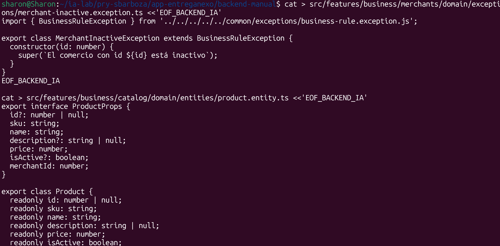

------------------------------------------------------------------------

### Paso 35: Capa de aplicación (`application`)

Creamos los casos de uso para registrar nuevos productos, validar que el comercio exista y consultar el catálogo de productos disponibles.

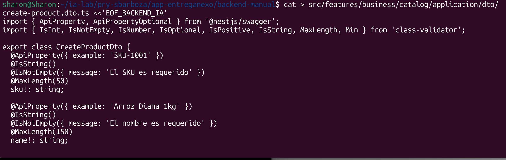

------------------------------------------------------------------------

### Paso 36: Capa de infraestructura (`infrastructure`)

Implementamos la persistencia creando el modelo de Sequelize con su relación hacia la tabla de comercios y el repositorio correspondiente.

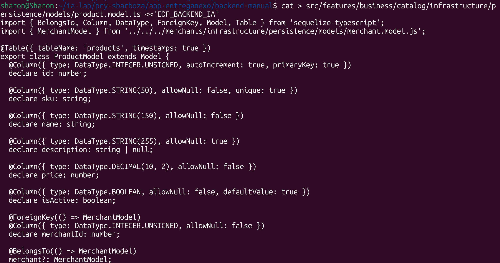

------------------------------------------------------------------------

### Paso 37: Capa de presentación y módulo (`presentation`)

Creamos el controlador HTTP para exponer las rutas del catálogo y agrupamos todo dentro de `catalog.module.ts`.

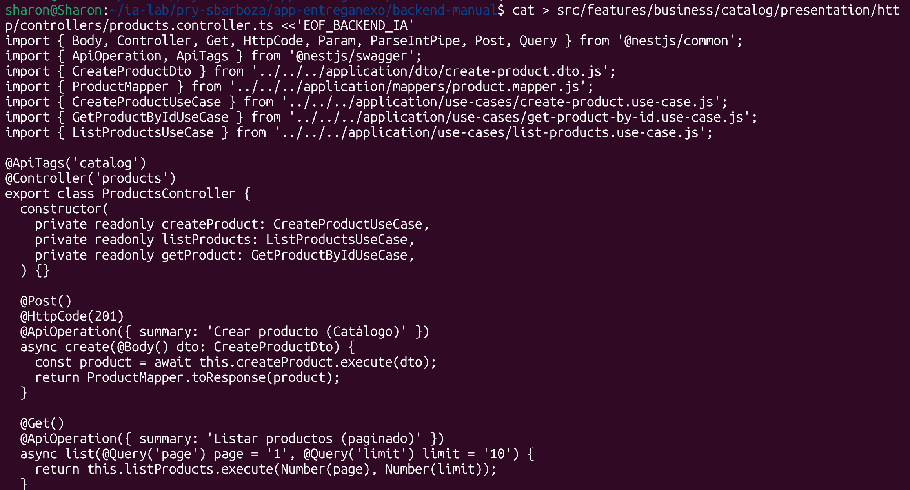

------------------------------------------------------------------------

### Paso 38: Registro del modelo en Sequelize y verificación del servidor

Añadimos el modelo `ProductModel` a la configuración global de Sequelize y comprobamos con `npm run start:dev` que el servidor levanta y sincroniza la nueva tabla sin inconvenientes.

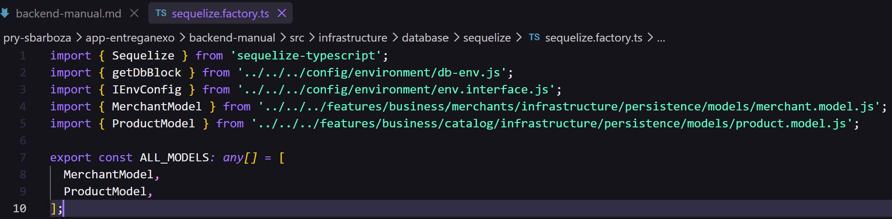

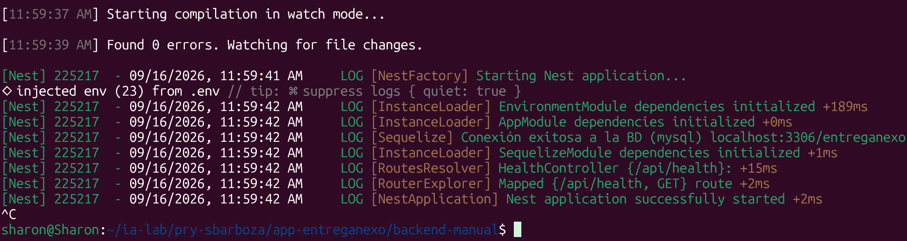

------------------------------------------------------------------------

## 7. Fase 6: Feature de Clientes (ISS-05)

Continuamos con la tarea **ISS-05** implementando la feature de **Clientes (`clients`)**.

Esta feature es un requisito indispensable antes de construir la feature de **Pedidos** (ISS-06). Cada pedido necesita asociar obligatoriamente dos llaves foráneas: un Producto y un Cliente. Sin la tabla de clientes lista, el sistema no permitiría registrar pedidos en la base de datos.

### Paso 39: Capa de dominio de clientes (`domain`)

Definimos la entidad pura `Client` con los atributos esenciales del comprador (nombre, correo, teléfono y dirección).

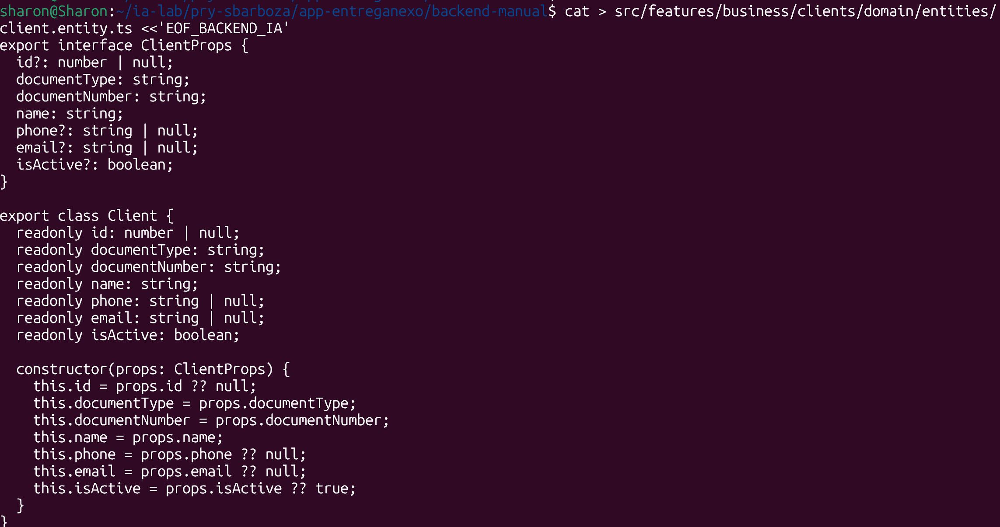

------------------------------------------------------------------------

### Paso 40: Capa de aplicación (`application`)

Implementamos los casos de uso para registrar y consultar clientes en la plataforma.


------------------------------------------------------------------------

### Paso 41: Capa de infraestructura (`infrastructure`)

Creamos el modelo y repositorio de Sequelize para gestionar la persistencia de los clientes en la base de datos.

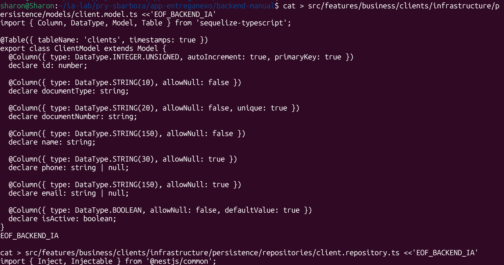

------------------------------------------------------------------------

### Paso 42: Capa de presentación (`presentation`)

Definimos el controlador HTTP con los endpoints para clientes y agrupamos la feature en `clients.module.ts`.

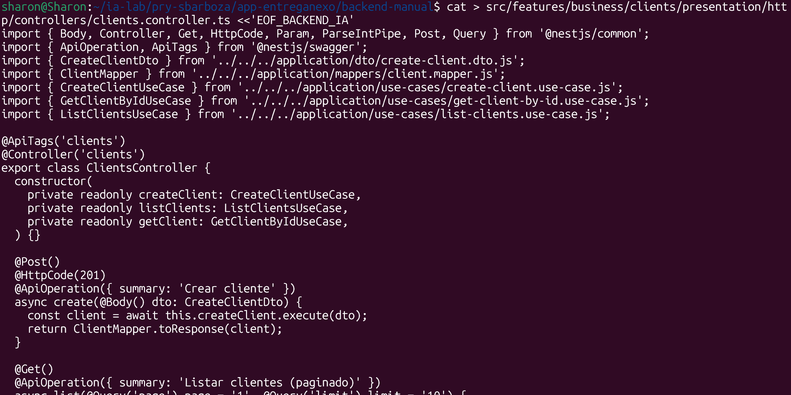

------------------------------------------------------------------------

### Paso 43: Registro del modelo de clientes en Sequelize

Registramos el modelo `ClientModel` en la configuración de Sequelize, dejando la base de datos lista para soportar la creación de pedidos en el siguiente paso.

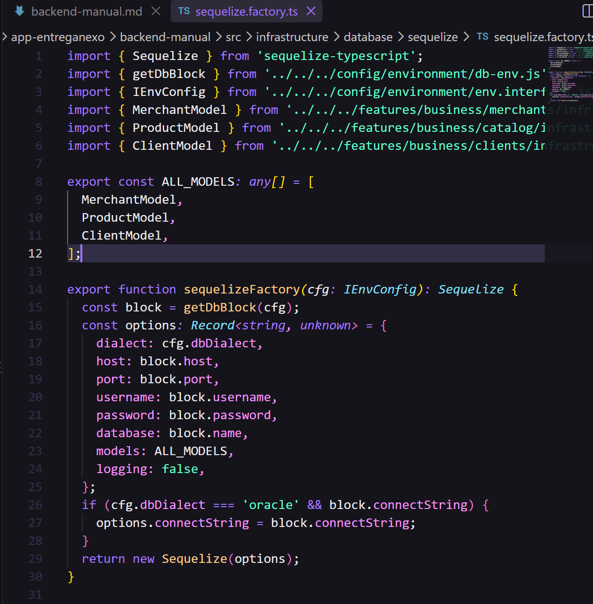

------------------------------------------------------------------------

## 8. Fase 7: Feature de Pedidos y Transacciones Atómicas (ISS-06)

En la tarea **ISS-06**, desarrollamos la feature de **Pedidos (`orders`)**, que agrupa las entidades `Order` (cabecera del pedido) y `OrderDetail` (productos y cantidades solicitadas).

Esta feature es una de las más críticas de la plataforma, ya que maneja reglas financieras y de consistencia: \* Comprueba que el cliente solicitante exista en el sistema. \* Valida que el comercio origen esté registrado y activo. \* Calcula subtotales, comisión de la plataforma y el total final. \* Aplica una **transacción atómica en base de datos**: la cabecera del pedido y todos sus detalles se guardan juntos de manera indivisible. Si ocurre algún error a mitad de camino, la base de datos ejecuta un *rollback* automático (deshace los cambios) para evitar inconsistencias financieras.

### Paso 44: Capa de dominio de pedidos (`domain`)

Definimos las entidades de dominio `Order` y `OrderDetail`, junto con sus estados posibles (pendiente, confirmado, entregado, cancelado) y los métodos para calcular los totales de la compra.

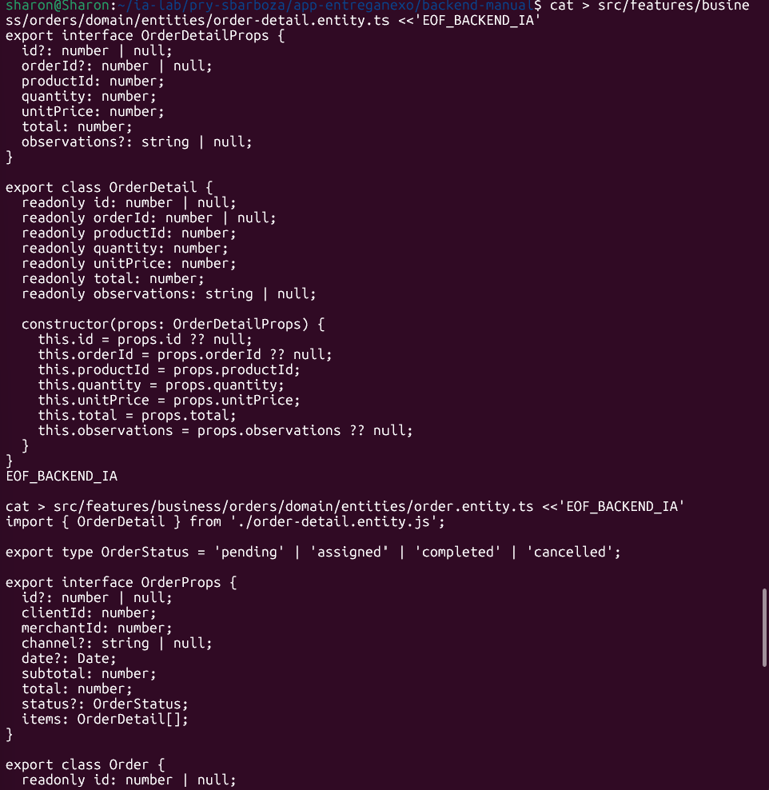

------------------------------------------------------------------------

### Paso 45: Capa de aplicación de pedidos (`application`)

Implementamos los DTOs, mappers y el caso de uso para crear pedidos, coordinando la validación del cliente, del comercio y del cálculo de importes.

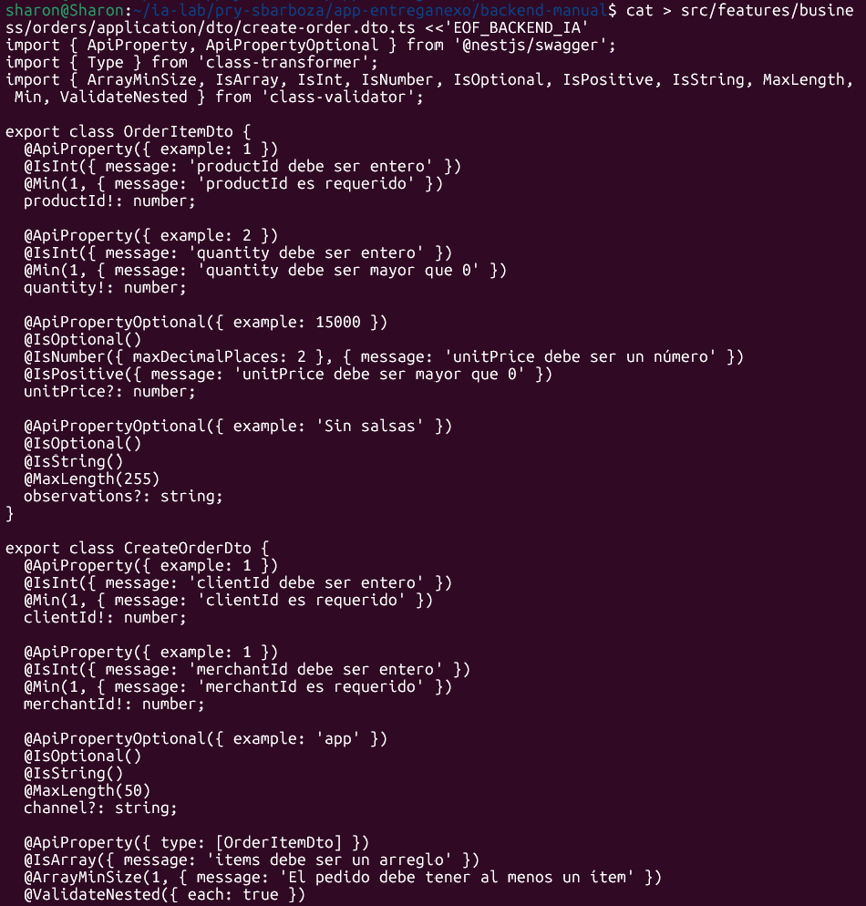

------------------------------------------------------------------------

### Paso 46: Capa de infraestructura y transacciones atómicas (`infrastructure`)

Creamos los modelos `OrderModel` y `OrderDetailModel` en Sequelize, y desarrollamos el repositorio implementando transacciones de base de datos (`transaction`). De esta manera, aseguramos que la orden y sus detalles se guarden con atomicidad (todo o nada).

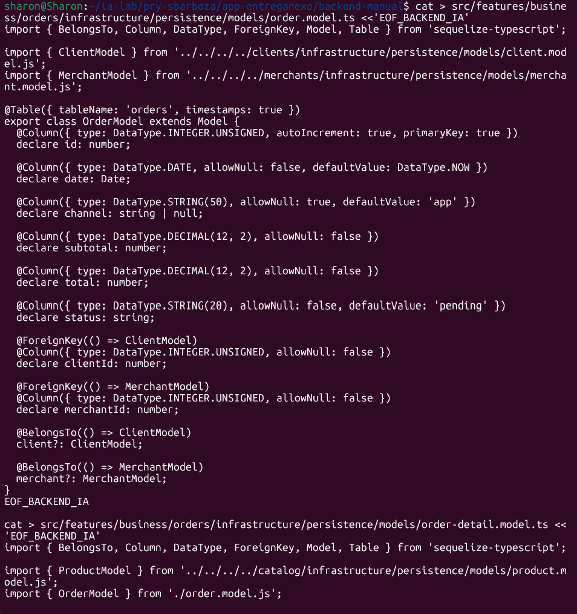

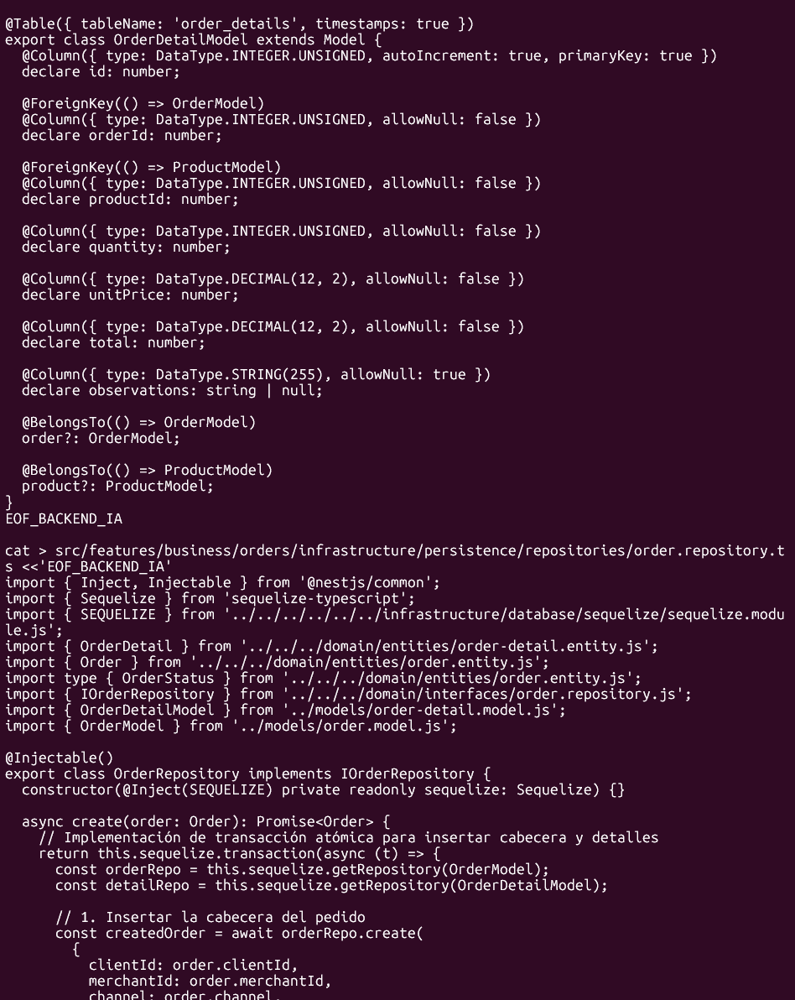

------------------------------------------------------------------------

### Paso 47: Capa de presentación y módulo (`presentation`)

Construimos el controlador HTTP para recibir las solicitudes de pedidos a través de los endpoints de la API y empaquetamos todo dentro de `orders.module.ts`.

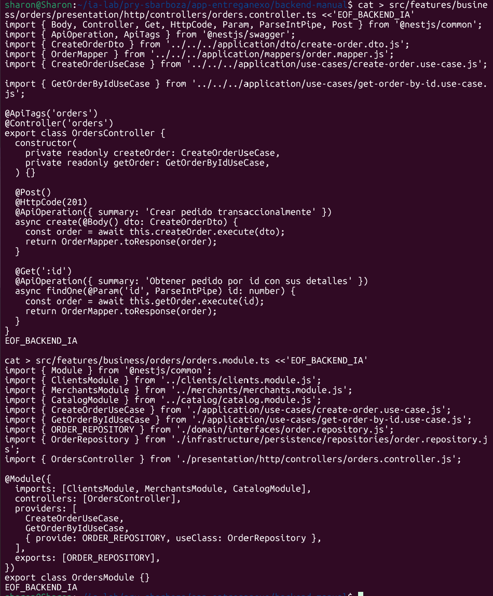

------------------------------------------------------------------------

### Paso 48: Registro de los modelos de pedidos en Sequelize

Añadimos `OrderModel` y `OrderDetailModel` al arreglo de modelos en `sequelize.factory.ts`, dejando registradas ambas tablas para su sincronización con la base de datos.

------------------------------------------------------------------------

## 9. Fase 8: Pruebas Automatizadas y Validación con Swagger

### Paso 49: Configuración y ejecución de pruebas con Vitest

Configuramos el entorno de pruebas automatizadas con Vitest y ejecutamos una prueba de integración (E2E) para verificar que los componentes y endpoints de la aplicación respondan de forma consistente.

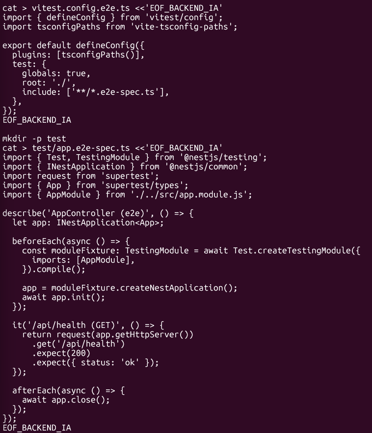

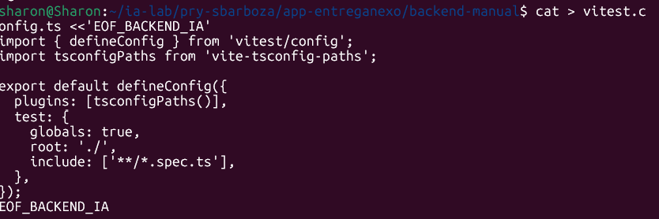

------------------------------------------------------------------------

### Paso 50: Verificación visual de endpoints mediante Swagger UI

Para probar la API de forma interactiva, aprovechamos la integración con Swagger accediendo desde el navegador a `http://localhost:3002/api/docs`. Allí encontramos documentados todos los endpoints creados para `merchants`, `catalog`, `clients` y `orders`.

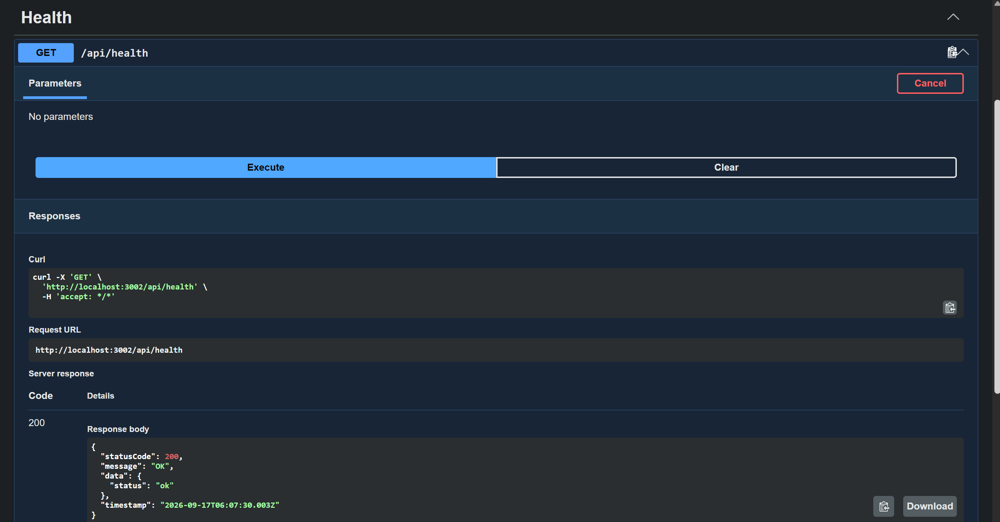

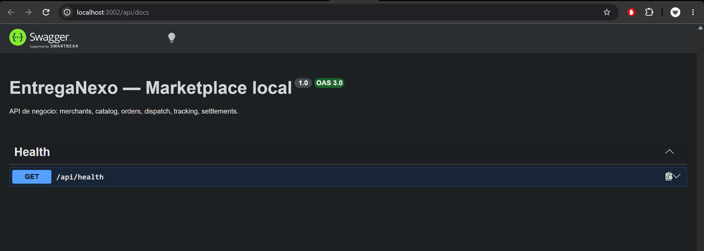

------------------------------------------------------------------------

### Paso 51: Ejecución de peticiones y respuesta exitosa (HTTP 200)

Realizamos pruebas sobre los endpoints directamente desde la interfaz de Swagger y comprobamos que las solicitudes se procesan correctamente, retornando un código de estado `200 OK` con los datos esperados.

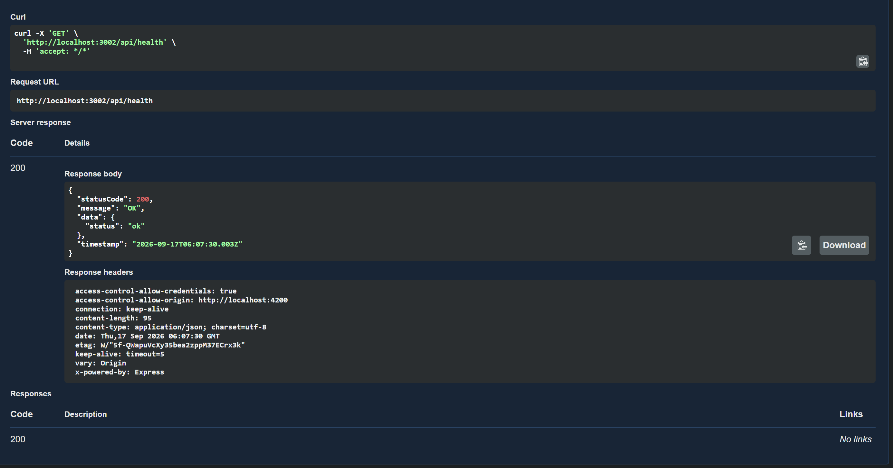

------------------------------------------------------------------------

## 10. Fase 9: Pruebas y Validación Multibase de Datos

Una de las ventajas clave de la arquitectura desacoplada que configuramos con Sequelize y variables de entorno es la **portabilidad total**: podemos alternar entre los distintos motores de base de datos relacionales simplemente cambiando una variable en el archivo `.env`, sin necesidad de modificar el código de la aplicación.

### Paso 52: Validación y sincronización en PostgreSQL

Cambiamos la variable `DB_DIALECT` a `postgres` en el archivo `.env`:

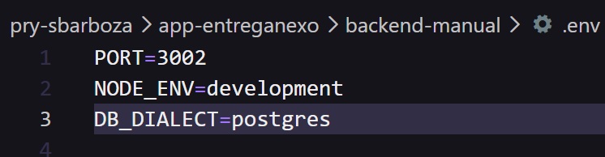

Iniciamos el servidor en modo desarrollo (`npm run start:dev`) y comprobamos en la consola que la conexión con el contenedor `entreganexo-postgres` se establece sin problemas, sincronizando y creando automáticamente las 5 tablas del proyecto (`merchants`, `products`, `clients`, `orders` y `order_details`):

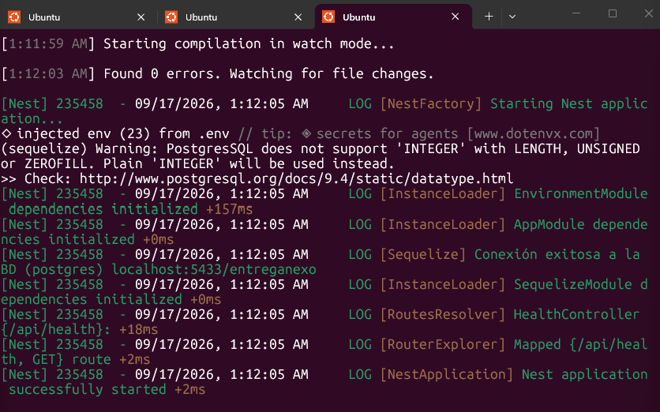

------------------------------------------------------------------------

### Paso 53: Validación y sincronización en Microsoft SQL Server (MSSQL)

Repetimos la prueba configurando el dialecto para SQL Server (`DB_DIALECT=mssql`) en el archivo `.env`:

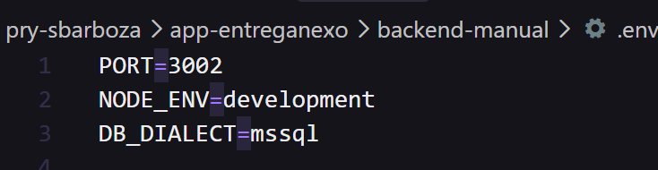

Verificamos en la terminal que el driver `tedious` se conecta correctamente al contenedor `entreganexo-mssql`, levantando el servidor y dejando las tablas sincronizadas en la base de datos:

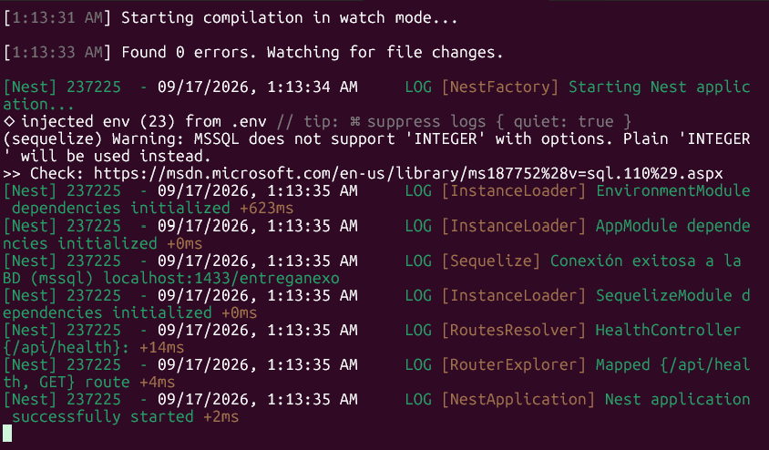

------------------------------------------------------------------------

### Paso 54: Validación y sincronización en Oracle Database

Por último, probamos la conexión con **Oracle** ajustando la configuración a `DB_DIALECT=oracle` en el archivo `.env`.

Comprobamos en los registros de la terminal que el cliente `oracledb` se conecta de forma exitosa a la instancia de Oracle y que el servidor queda activo y listo para operar:

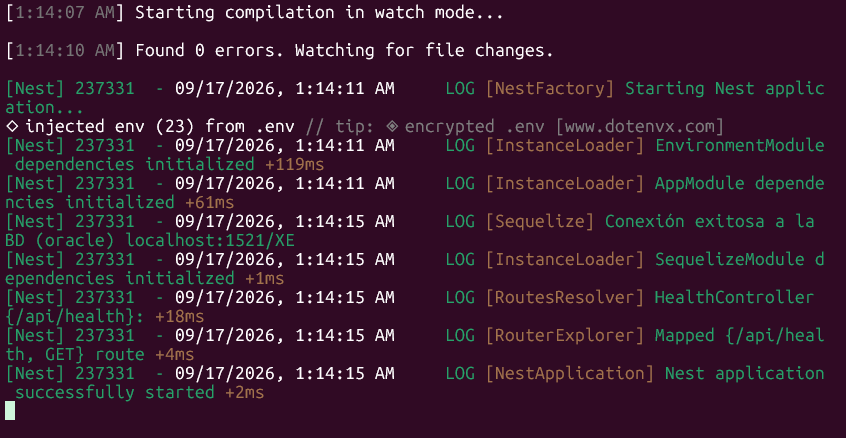
